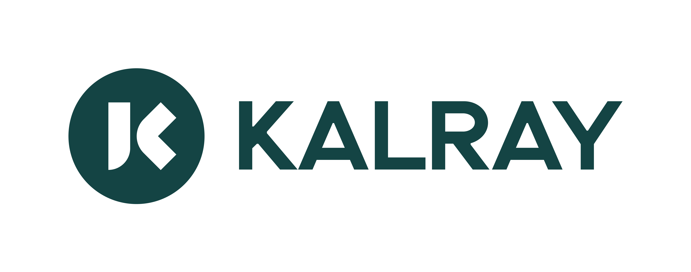
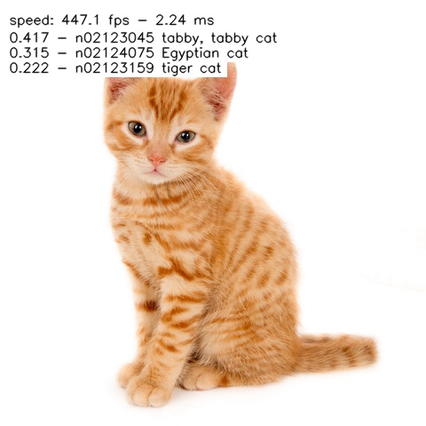
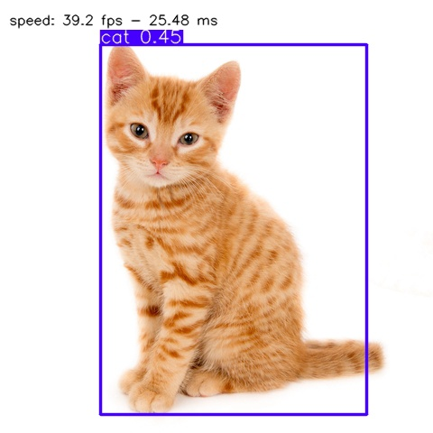
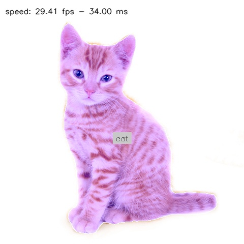

# KaNN™ Model Zoo

</a> 

 

The KaNN™ Model Zoo repository offers a collection of neural network models **ready to compile & run** on Kalray's MPPA®
manycore processor. Coolidge V2, the 3rd and latest generation of our MPPA®, is a dedicated processor for **AI applications**.
KaNN™ Model Zoo complements the KaNN™ SDK, which streamlines model generation and optimizes **AI performance** on Kalray's processors.

  We are pleased to announce that our models are available on our Kalray space 
   

## Contents

CNN models are grouped by three types of machine vision applications:
* [Classification](./networks/classifiers/README.md): DenseNet, EfficientNet, Inception, MobileNet, NasNet, ResNet, RegNet, SqueezeNet, VGG
* [Object Detection](./networks/object-detection/README.md): EfficientDet, RetinatNet, SSD, YOLO
* [Segmentation](./networks/segmentation/README.md): DeeplabV3+, Fully Convolution Network (FCN), U-Net, YOLO

The examples below illustrate the kind of predictions obtained for each application type:

| Classification 
 (e.g. SqueezeNet)                                     | Object Detection 
 (e.g. YOLOv8n)                                       | Segmentation 
 (e.g. Deeplabv3+)                                      |
|--------------------------------------------------------------------------|---------------------------------------------------------------------------|-------------------------------------------------------------------------|
| </a> | </a> | </a> |

**images have been generated from this repository and KaNN™ SDK solution (ACE 5.4.0)*

## Kalray Neural Network (KaNN™) SDK

Kalray Neural Network (KaNN™) is a SDK included in the AccessCore Embedded (ACE™) compute offer to optimize AI inference on MPPA®. 
It is composed by:

* **KaNN™ generator** : A python wheel to parse, optimize and paralellize an intermediate representation of a neural
  network. Thanks to the runtime, it gives you then the opportunity to run the algorithm directly on the MPPA®
* **KaNN™ runtime** : Optimized libraries (in ASM/C/C++) to execute each operation node.

ACE™ 6.0.0 | KaNN™ 5.5.0 supports: ONNX framework.

## Important notes

* Neural networks are available on our **Hugging face plateform** 🤗 [HERE](https://huggingface.co/Kalray).
  Do not hesitate to check model card for details of implementation, sources or license.

* TensorFlow and TensorFlowLite is now deprecated from this ACE™ version (>=6.0.0). All TF networks of the KaNN™
  Model Zoo have been converted to ONNX format with **tf2onnx** tools.

* To generate a neural network compatible for Kalray processor (MPPA®):
  + in FP16, please refer to onnx model (pointed by network_f16.yaml configuration file)
  + in INT8/FP16, use QDQ-model (pointed by the network_i8.yaml configuration file)

* Interesting to run faster ? please contact our support to optimize your use case at support@kalrayinc.com

## WIKI notes

To quickly deploy a neural network on the MPPA®, a WIKI note is available [here](WIKI.md):
* [KaNN™ framework description](./WIKI.md#kann-framework-description)
* [Prerequisites: SW environment \& configuration](./WIKI.md#prerequisites-sw-environment--configuration)
* [How models are packaged](./WIKI.md#how-models-are-packaged)
* [Generate a model to run on the MPPA®](./WIKI.md#generate-a-model-to-run-on-the-mppa®)
* [Evaluate the neural network inference on the MPPA®](./WIKI.md#evaluate-the-neural-network-inference-on-the-mppa®)
* [Run the neural network as a demo](./WIKI.md#run-the-neural-network-as-a-demo)
* [Custom Layers for extended neural network supoort](./WIKI.md#custom-layers-for-extended-neural-network-supoort)
* [Jupyter Notebooks](./WIKI.md#jupyter-notebooks)

## Requirements

### Hardware requirements

Host machine(s):

* x86_64 CPU
* DDR RAM 8 GB min
* HDD disk 32 GB min
* PCIe Gen3 min, Gen4 recommended

Acceleration card(s):

* 
* 

### Software requirements

* 
  
* 
  
* 
  
