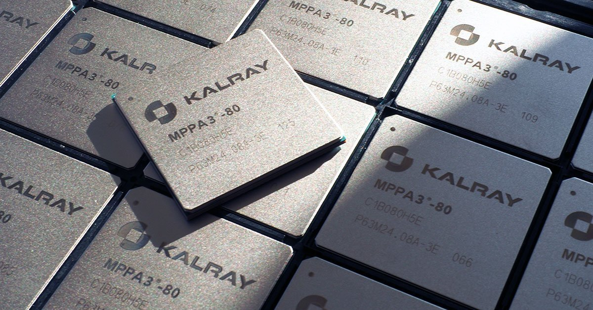
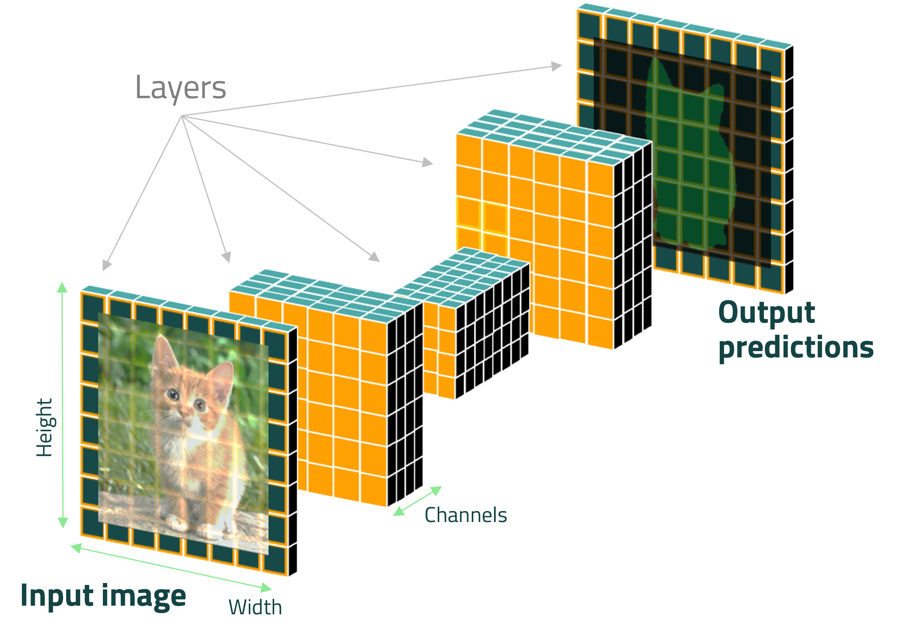
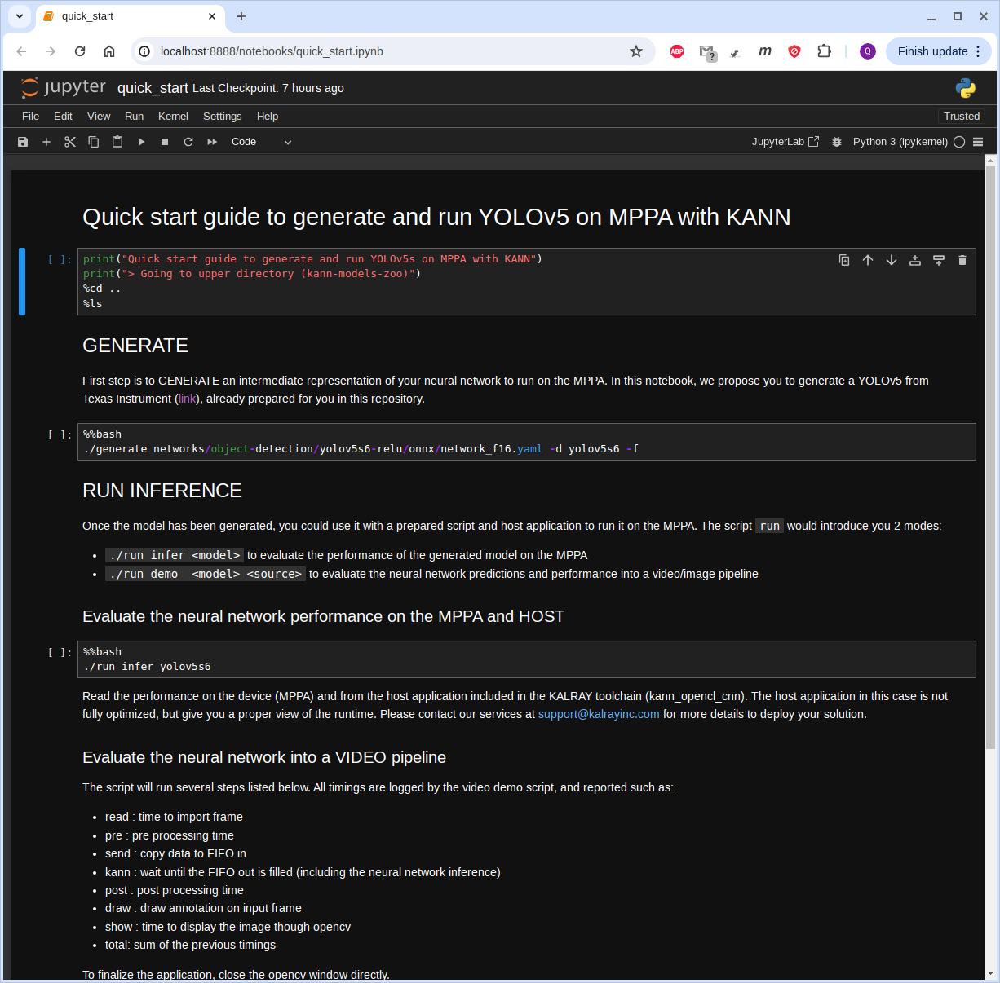

# WIKI - KaNN™ Model Zoo

</a></br>

 
  </br>

The Kalray KaNN™ Model Zoo repository offers a collection of neural network models **ready to compile & run** on Kalray's MPPA®
manycore processor. Coolidge V2, the 3rd and latest generation of our MPPA®, is a dedicated processor for **AI applications**.
KaNN™ Model Zoo complements the KaNN™ SDK, which streamlines model generation and optimizes **AI performance** on Kalray's processors.


## Table of contents

- [WIKI - KaNN™ Model Zoo](#wiki---kann-model-zoo)
  - [Table of contents](#table-of-contents)
  - [KaNN™ framework description](#kann-framework-description)
  - [Prerequisites: SW environment \& configuration](#prerequisites-sw-environment--configuration)
  - [How models are packaged](#how-models-are-packaged)
  - [Generate a model to run on the MPPA®](#generate-a-model-to-run-on-the-mppa)
  - [Evaluate the neural network inference on the MPPA®](#evaluate-the-neural-network-inference-on-the-mppa)
  - [Run the neural network as a demo](#run-the-neural-network-as-a-demo)
  - [Custom Layers for extended neural network supoort](#custom-layers-for-extended-neural-network-supoort)
  - [Jupyter Notebooks](#jupyter-notebooks)


## KaNN™ framework description

</a></br>

Kalray Neural Network (KaNN™) is a SDK included in the AccessCore Embedded (ACE) compute
 offer to optimize AI inference on MPPA®.
 
 It leverages the possibility to parse and analyze a Convolutional Neural Network (figure above)
 from the standardized ONNX framework for model interoperability and generate MPPA® byte code to
 achieve best performance efficiency. This wiki does not contain any information about the use of the
 KaNN™ API, but it helps to deploy and quickly evaluate AI solutions from preconfigured and validated model. 
 For details, please do not hesitate to read the documentation 😏 or contact us directly at support@kalrayinc.com

So, to deploy your solution from an identified neural network, the steps are all easy 😃:
1. From a CNN, generate the KaNN™ model bytecode (no HW dependencies)
2. Run the model from demo application (Python script & host application are included in the repository
   and AccessCore software)

Running the model requires a PCIe board with Kalray's MPPA®.

## Prerequisites: SW environment & configuration

Source the Kalray's AccessCore® environment, at the following location:
```bash
 source /opt/kalray/accesscore/kalray.sh
 ```
and check the envrionment variable `$KALRAY_TOOLCHAIN_DIR` is not empty.

If it does not exist, please configure a specific virtual python environment (recommended) *in a location of your choice*. E.g.:
```bash
KANN_ENV=$HOME/.local/share/python3-kann-venv
python3 -m venv $KANN_ENV
```
Source your python environment:
```bash 
source $KANN_ENV/bin/activate
```

Install locally the KaNN™ wheel and all dependencies (it supposed the ACE Release is installed in `$HOME` directory):
```bash
pip install $HOME/ACE6.0.0/KaNN-generator/kann-*.whl
```

Lastly, do the same for additional python requirements of this repo:
```bash 
pip install -r requirements.txt
```
Please also refer to the ACE SDK install procedure detailed [here](https://lounge.kalrayinc.com/hc/en-us/articles/19422051062940-ACE-6-0-0-Content-installation-release-note-and-Getting-Started-Coolidge-v2)

You are now all set up use the KaNN™ Model Zoo. Please don't forget to source **your** python environment any time you open a new terminal or adding the following lines to your .bashrc, .bashalias, or similar according to *your* choice earlier.
```bash
KANN_ENV=$HOME/.local/share/python3-kann-venv
source /opt/kalray/accesscore/kalray.sh
source $KANN_ENV/bin/activate
```

## How models are packaged

Each model is packaged to be compiled and run with KaNN™ SDK. In each model directory, you'll find:
- a pre-processing python script: `input_preparator.py`
- a post-processing directory: `output_preparator/`
- a model dir (empty), model wil be downloaded once the model is called for generation
- configuration files (*.yaml) for generation:
    * network_f16.yaml :  batch 1 - FP16 - nominal performance
    * network_i8.yaml :   batch 1 - FP16/Q-INT8 - nominal performance

Models LICENSE and SOURCES are described individually in our HuggingFace space, available at
https://huggingface.co/Kalray.

<p align="center">
  </a></br>
</p>

## Generate a model to run on the MPPA®

Use the following command to generate an model to run on the MPPA®:
```bash
# syntax: $ ./generate <configuration_file.yaml> -d <generated_path_dir>
./generate networks/object-detection/yolov8n-relu/onnx/network_f16.yaml -d yolov8n
```

It will provide you into the path directory `generated_path_dir`, here called "yolov8n":
* a <my_network>.kann file (network contents with runtime and context information)
* a network.dump.yaml file (a copy of the configuration file used)
* a log file of the generation

Please refer to Kalray's documentation and KaNN user manual provided for more details !

## Evaluate the neural network inference on the MPPA®

Kalray's toolchain integrates its own host application named `kann_opencl_cnn` to run compiled models.
To evaluate the performance of the neural network on the MPPA®, 2 manners are possible:
  + using `./run` script wit the `infer` sub-command (it will use the `kann run` command indirectly)
  + or directly, `kann run` cli-commmand offered by KaNN

Use the following command to start quickly the inference:
```bash
# ./run infer <generated_path_dir>
./run infer yolov8n
```
or
```bash
# kann run <generated_path_dir> --nb-frames=25
kann run yolov8n -n 25
```

> **TIPS 😎 ...**
Now, with kann it is possible to evaluate directly an ONNX model from HuggingFace with this method:
  ```bash
  # kann generate --model=<HF_REPO_ID>/<FILENAME.onnx> -d <GEN_DIR> 
  # kann run <GEN_DIR>
  kann generate --model=Kalray/yolov8n-relu/yolov8n-relu-s.optimized.onnx \
    --quantize_fp32_to_fp16=True -d yolov8n-mppa-fp16
  # then
  kann run yolov8n-mppa-fp16
  ```
NB: input and output processing scripts are not included in this case, only the IR model is generate from ONNX file.
In the case you want to run a demo pipeline, please use the packaged models included in **KaNN Model Zoo** or include
your own scripts.

## Run the neural network as a demo

Use the following command to start the inference of, the model just
generated, from a video pipeline. It will include the inference into a pre-
and post-processing scripts with a video/image stream input, supported by
the OpenCV Python API.

Use the following command to start inference with the newly generated model
 from a video pipeline. This setup integrates inference with pre- and 
 post-processing scripts, utilizing a video or image stream input supported
 by the OpenCV Python API.

```bash
# ./run demo <generated_path_dir> <source_file_path>
./run demo yolov8n ./utils/sources/cat.jpg
```

All timings are logged by the video demo script, and reported such as:
+ read : time to import frame
+ pre  : pre processing time
+ send : copy data to FIFO in
+ kann : wait until the FIFO out is filled (including the neural network inference)
+ post : post processing time
+ draw : draw annotation on input frame
+ show : time to display the image though opencv
+ total: sum of the previous timings

To disable the L2 cache at runtime add the '--l2-off' argument:
```bash
./run --l2-off demo yolov8n ./utils/sources/dog.jpg
```
This allows using a larger fraction of the MPPA®'s DDR for data buffers.
 Disabling L2 cache is also implicitly done in KaNN™ Model Zoo if we detect the 
 `data_buffer_size` in the model's configuraiton `*.yaml` file requires us to do so.
 A warning will be displayed if L2 cache is disabled without explicitly setting the
 flag as mentioned above.

To disable the display:
```bash
./run demo yolov8n ./utils/sources/street/street_0.jpg --no-display
```

To disable the replay (for a video or a image):
```bash
./run demo yolov8n ./utils/sources/street/street_0.jpg --no-replay
```

Save the last frame annotated into the current dir:
```bash
./run demo yolov8n ./utils/sources/street/street_0.jpg --no-replay --save-img --verbose
```

To run on the CPU target (in order to compare results):
```bash
./run demo --device=cpu yolov8n ./utils/sources/street/street_0.jpg --no-replay --save-img --verbose
```

Demonstration scripts are provided in python.

> **PLEASE NOTE**
> `kann_opencl_cnn` is a simple and generic host application for neural network inference on MPPA®.
> It does not use pipelining. Thus video pipeline is **NOT FULLY OPTIMIZED** and  requires custom developments to 
> benefit of the full performance of the MPPA®, depending of your own environment and system. Do not hesitate to 
> contact our services <support@kalrayinc.com> to optimize your solution.

Please take a look to our notebooks included in the repository (see [Jupyter Notebooks](#jupyter-notebooks))

## Custom Layers for extended neural network supoort

According to the Kalray's documentation in KaNN™ manual, users have the possibility to integrate
custom layers in case layers are not supported by KaNN™. This can be done by following these
general steps:
1. Implement the python function callback to ensure that KaNN™ generator is able to support the layer
2. Implement the layer python class to ensure that arguments are matching with the C-function
3. Implement the C-function into the SimpleMapping macro, provided in the example
4. Build the C-function with Kalray makefile and reuse it for inference

For more details please refer to the KaNN™ user manual.

To ensure extended support of all neural networks provided in the repository (such as YOLOv8) the
 `kann_custom_layers` directory contains implementations of the following custom layers:
 * SiLU

Please follow these few steps to use custom layer implementations, for example to support YOLOv8:
1. Configure _YOUR_ software environment:
```bash
KANN_ENV=$HOME/.local/share/python3-kann-venv
source /opt/kalray/accesscore/kalray.sh
source $KANN_ENV/bin/activate
```

B. Then, buid custom kernels to run over the MPPA®:
```bash
make -BC kann_custom_layers O=$PWD/output
```

3. Generate the model:
```bash
PYTHONPATH=$PWD/kann_custom_layers ./generate $PWD/networks/object-detection/yolov8n/onnx/network_f16.yaml -d yolov8n-custom
```

4. Run demo with generated the generated directory (`yolov8n` in this example) and the newly complied kernels (.pocl file) for the MPPA®:
```bash
./run --pocl-dir=$PWD/output/opencl_kernels demo --device=mppa yolov8n-custom ./utils/sources/cat.jpg --verbose
```
or run the model on CPU target (in order to compare results):
```bash
./run demo --device=cpu yolov8n-custom ./utils/sources/cat.jpg --verbose
```

## Jupyter Notebooks

You may also notice a folder called `./notebooks/`  which is available in this repository. It provides additional usage examples. Let's take a look at:
* [x] [Quick Start](./notebooks/quick_start.ipynb): Generate and run a neural network from the KaNN™ Model Zoo

To execute it, please set up your python environment and be sure you could use correctly your preferred web browser
(firefox, google-chrome, ... for example) :

```bash
# source YOUR python environment if not done
KANN_ENV=$HOME/.local/share/python3-kann-venv
source $KANN_ENV/bin/activate
# install jupyter notebook package
pip install jupyter
# wait that all dependencies are installed ...
```

From kann-model-zoo home directory, then open the desired notebook:

```bash
jupyter notebook notebooks/quick_start.ipynb &
```

A new window will appear such as

</a></br>

Finally, select & click to `Run` > `Run All Cells (Shift+Enter)` to execute all commands in-line ...
et voilà 😃. Don't forget restart the kernel if needed and to kill the jupyter notebook server once you're done.

Other notebooks will be soon available:
* [ ] Advanced: import a neural network and create a package to run on the MPPA
* [ ] Graph inspection: analyze a neural network generated by kann
* [ ] Fine-tune: optimize the generation of a neural network
* [ ] Custom layer (basic) : use the custom layer already implemented in this repository
* [ ] Custom layer (advanced): Implement a custom layer to support a specific network
* [ ] Custom kernel (advanced): Implement a custom kernel to support a specific network
* [ ] Custom kernel (expert): Optimie a custom kernel to accelerate a specific network

Authors:
 + Quentin Muller <qmuller@kalrayinc.com>
 + Björn Striebing <bstriebing@kalrayinc.com>

