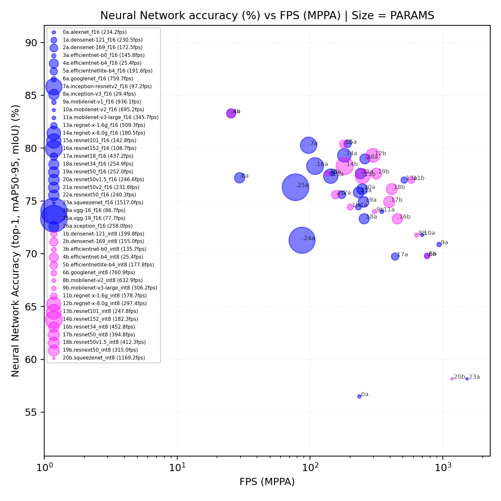

</a>

## List of Classification Neural Networks

This repository gives access to following classification neural networks by architecture:

* DenseNet, EfficientNet, Inception, MobileNet, NasNet, Resnet, RegNet, SqueezeNet, VGG

Please find below, the neural networks listed according to their Top-1 accuracy vs
Device performance in FPS at BATCH=1 / MPPA (ACE 6.0.0):

<p align="center">
  </a></br>
  <i><b>Fig1.</b> Neural network accuracy (top-1) [%] vs Device performance in [FPS] at batch 1 / MPPA;</br>
    bubble size is relative to PARAMs model size; blue: FP16 models; magenta: INT8 quantized models </i>
</p>
Do not hesitate to see in detail the complete table below for all neural networks.

## Important notes

* Neural networks are available on our **Hugging face plateform** 🤗 [HERE](https://huggingface.co/Kalray).
  Do not hesitate to check model card for details of implementation, sources or license.

* All models have been trained on **ImageNet Large Scale Visual Recognition Challenge 2012**
  [ILSVRC2012](https://www.image-net.org/challenges/LSVRC/2012/) dataset

* To generate a neural network with KaNN :
  + in FP16, refer to ONNX model (pointed by network_f16.yaml)
  + in INT8/FP16, use QDQ-model (pointed by network_i8.yaml)
  + please see [WIKI.md](../../WIKI.md) for instructions on how to use any of these models

  Example of use:
  ```bash
  # Generate
  kann generate ./networks/classifiers/regnet-x-1.6g/onnx/network_f16.yaml -d regnet-x-1.6g
  # wait ...
  # then, run
  kann run regnet-x-1.6g
  # observe the output to consider the global and detailed performance
  ```

## Neural Networks

The models are listed below, according:
  + the accuracy metrics (TopK accuracy here for classifiers)
  + Performance is given at **batch 1** per MPPA in :
    * Frame per second from device point of view

See more about our products here: [Coolidge2, K300, TC4](../../README.md#acceleration-cards)

<!-- START AUTOMATED TABLE -->
| NAME                                                                     |  FLOPs |  Params | accTop1 | accTop5 | Dtype |  Input  | 🤗 HF repo-id                                                                    | FPS (K300) | FPS (TC4) |
| :----------------------------------------------------------------------- | -----: | ------: | :-----: | :-----: | :---- | :-----: | :------------------------------------------------------------------------------ | ---------: | --------: |
| [alexNet F16](./alexnet/onnx/network_f16.yaml)                           |  1.3 G |  60.9 M | 56.52 % | 79.06 % | FP16  | 224x224 | [Kalray/alexnet](huggingface.co/Kalray/alexnet)                                 |      234.2 |       936 |
| [denseNet-121 Q-INT8](./densenet-121/onnx/network_i8.yaml)               |  5.7 G |   8.0 M | 74.43 % | 91.9 %  | QINT8 | 224x224 | [Kalray/densenet-121](https://huggingface.co/Kalray/densenet-121)               |      199.8 |       799 |
| [denseNet-121 F16](./densenet-121/onnx/network_f16.yaml)                 |  5.7 G |   8.0 M | 74.43 % | 91.97 % | FP16  | 224x224 | [Kalray/densenet-121](https://huggingface.co/Kalray/densenet-121)               |      230.5 |       922 |
| [denseNet-169 Q-INT8](./densenet-169/onnx/network_i8.yaml)               |  6.7 G |  14.2 M | 75.6 %  | 92.8 %  | QINT8 | 224x224 | [Kalray/densenet-169](https://huggingface.co/Kalray/densenet-169)               |      154.9 |       619 |
| [denseNet-169 F16](./densenet-169/onnx/network_f16.yaml)                 |  6.7 G |  14.2 M | 75.6 %  | 92.81 % | FP16  | 224x224 | [Kalray/densenet-169](https://huggingface.co/Kalray/densenet-169)               |      172.4 |       689 |
| [efficientNet-B0 Q-INT8](./efficientnet-b0/onnx/network_i8.yaml)         |  1.0 G |   5.2 M | 77.6 %  | 93.5 %  | QINT8 | 224x224 | [Kalray/efficientnet-b0](https://huggingface.co/Kalray/efficientnet-b0)         |      135.6 |       542 |
| [efficientNet-B0 F16](./efficientnet-b0/onnx/network_f16.yaml)           |  1.0 G |   5.2 M | 77.69 % | 93.53 % | FP16  | 224x224 | [Kalray/efficientnet-b0](https://huggingface.co/Kalray/efficientnet-b0)         |      145.7 |       583 |
| [efficientNet-B4 Q-INT8](./efficientnet-b4/onnx/network_i8.yaml)         | 11.7 G |  16.8 M | 83.3 %  | 96.5 %  | QINT8 | 224x224 | [Kalray/efficientnet-b4](https://huggingface.co/Kalray/efficientnet-b4)         |       25.4 |       101 |
| [efficientNet-B4 F16](./efficientnet-b4/onnx/network_f16.yaml)           | 11.7 G |  16.8 M | 83.38 % | 96.59 % | FP16  | 224x224 | [Kalray/efficientnet-b4](https://huggingface.co/Kalray/efficientnet-b4)         |       25.4 |       101 |
| [efficientNetLite-B4 Q-INT8](./efficientnetlite-b4/onnx/network_i8.yaml) |  2.7 G |  12.9 M | 80.4 %  |    -    | QINT8 | 224x224 | [Kalray/efficientNetLite-B4](https://huggingface.co/Kalray/efficientnetlite-b4) |      177.7 |       711 |
| [efficientNetLite-B4 F16](./efficientnetlite-b4/onnx/network_f16.yaml)   |  2.7 G |  12.9 M | 80.4 %  |    -    | FP16  | 224x224 | [Kalray/efficientNetLite-B4](https://huggingface.co/Kalray/efficientnetlite-b4) |      191.6 |       766 |
| [googleNet Q-INT8](./googlenet/onnx/network_i8.yaml)                     |  3.0 G |   6.6 M | 69.8 %  | 89.5 %  | QINT8 | 224x224 | [Kalray/googlenet](https://huggingface.co/Kalray/googlenet)                     |      760.8 |      3043 |
| [googleNet F16](./googlenet/onnx/network_f16.yaml)                       |  3.0 G |   6.6 M | 69.8 %  | 89.5 %  | FP16  | 224x224 | [Kalray/googlenet](https://huggingface.co/Kalray/googlenet)                     |      759.7 |      3038 |
| [inception-resnetv2 F16](./inception-resnetv2/onnx/network_f16.yaml)     |  13. G |  55.9 M | 80.3 %  | 95.3 %  | FP16  | 229x229 | [Kalray/inception-resnetv2](https://huggingface.co/Kalray/inception-resnetv2)   |       97.2 |       388 |
| [inception-V3 F16](./inception-v3/onnx/network_f16.yaml)                 | 11.4 G |  27.1 M | 77.2 %  | 93.4 %  | FP16  | 299x299 | [Kalray/inception-v3](https://huggingface.co/Kalray/inception-v3)               |       29.4 |       117 |
| [mobileNet-V1 F16](./mobilenet-v1/onnx/network_f16.yaml)                 |  1.1 G |   4.1 M | 70.9 %  | 89.9 %  | FP16  | 224x224 | [Kalray/mobilenet-v1](https://huggingface.co/Kalray/mobilenet-v1)               |      936.0 |      3744 |
| [mobileNet-V2 Q-INT8](./mobilenet-v2/onnx/network_i8.yaml)               |  0.8 G |   3.5 M | 71.8 %  | 90.2 %  | QINT8 | 224x224 | [Kalray/mobilenet-v2](https://huggingface.co/Kalray/mobilenet-v2)               |      632.9 |      2531 |
| [mobileNet-V2 F16](./mobilenet-v2/onnx/network_f16.yaml)                 |  0.8 G |   3.5 M | 71.88 % | 90.29 % | FP16  | 224x224 | [Kalray/mobilenet-v2](https://huggingface.co/Kalray/mobilenet-v2)               |      695.2 |      2780 |
| [mobileNet-V3-large Q-INT8](./mobilenet-v3-large/onnx/network_i8.yaml)   |  0.4 G |   5.4 M | 74.0 %  | 91.3 %  | QINT8 | 224x224 | [Kalray/mobilenet-v3-large](https://huggingface.co/Kalray/mobilenet-v3-large)   |      306.1 |      1224 |
| [mobileNet-V3-large F16](./mobilenet-v3-large/onnx/network_f16.yaml)     |  0.4 G |   5.4 M | 74.04 % | 91.34 % | FP16  | 224x224 | [Kalray/mobilenet-v3-large](https://huggingface.co/Kalray/mobilenet-v3-large)   |      345.6 |      1382 |
| [regNet-x-1.6g Q-INT8](./regnet-x-1.6g/onnx/network_i8.yaml)             |  3.2 G |   9.1 M | 77.0 %  | 93.4 %  | QINT8 | 224x224 | [Kalray/regnet-x-1.6g](https://huggingface.co/Kalray/regnet-x-1.6g)             |      578.7 |      2314 |
| [regNet-x-1.6g F16](./regnet-x-1.6g/onnx/network_f16.yaml)               |  3.2 G |   9.1 M | 77.04 % | 93.44 % | FP16  | 224x224 | [Kalray/regnet-x-1.6g](https://huggingface.co/Kalray/regnet-x-1.6g)             |      509.3 |      2037 |
| [regNet-x-8.0g Q-INT8](./regnet-x-8.0g/onnx/network_i8.yaml)             | 16.0 G |  39.5 M | 79.3 %  | 94.6 %  | QINT8 | 224x224 | [Kalray/regnet-x-8.0g](https://huggingface.co/Kalray/regnet-x-8.0g)             |      297.4 |      1189 |
| [regNet-x-8.0g F16](./regnet-x-8.0g/onnx/network_f16.yaml)               | 16.0 G |  39.5 M | 79.34 % | 94.68 % | FP16  | 224x224 | [Kalray/regnet-x-8.0g](https://huggingface.co/Kalray/regnet-x-8.0g)             |      180.5 |       722 |
| [resnet101 Q-INT8](./resnet101/onnx/network_i8.yaml)                     | 15.2 G |  44.7 M | 77.3 %  | 93.5 %  | QINT8 | 224x224 | [Kalray/resnet101](https://huggingface.co/Kalray/resnet101)                     |      247.7 |       991 |
| [resnet101 F16](./resnet101/onnx/network_f16.yaml)                       | 15.2 G |  44.7 M | 77.37 % | 93.54 % | FP16  | 224x224 | [Kalray/resnet101](https://huggingface.co/Kalray/resnet101)                     |      142.8 |       571 |
| [resnet152 Q-INT8](./resnet152/onnx/network_i8.yaml)                     | 22.6 G |  60.4 M | 78.3 %  | 94.0 %  | QINT8 | 224x224 | [Kalray/resnet152](https://huggingface.co/Kalray/resnet152)                     |      182.2 |       729 |
| [resnet152 F16](./resnet152/onnx/network_f16.yaml)                       | 22.6 G |  60.4 M | 78.31 % | 94.04 % | FP16  | 224x224 | [Kalray/resnet152](https://huggingface.co/Kalray/resnet152)                     |      108.6 |       434 |
| [resnet18 F16](./resnet18/onnx/network_f16.yaml)                         |  3.6 G |  11.7 M | 69.75 % | 89.07 % | FP16  | 224x224 | [Kalray/resnet18](https://huggingface.co/Kalray/resnet18)                       |      761.1 |      3044 |
| [resnet18 F16](./resnet18/onnx/network_f16.yaml)                         |  3.6 G |  11.7 M | 69.75 % | 89.07 % | FP16  | 224x224 | [Kalray/resnet18](https://huggingface.co/Kalray/resnet18)                       |      437.2 |      1748 |
| [resnet34 Q-INT8](./resnet34/onnx/network_i8.yaml)                       |  7.3 G |  21.8 M | 73.3 %  | 91.4 %  | QINT8 | 224x224 | [Kalray/resnet34](https://huggingface.co/Kalray/resnet34)                       |      452.7 |      1811 |
| [resnet34 F16](./resnet34/onnx/network_f16.yaml)                         |  7.3 G |  21.8 M | 73.31 % | 91.42 % | FP16  | 224x224 | [Kalray/resnet34](https://huggingface.co/Kalray/resnet34)                       |      254.8 |      1019 |
| [resnet50 Q-INT8](./resnet50/onnx/network_i8.yaml)                       |  7.7 G |  25.6 M | 74.9 %  | 92.3 %  | QINT8 | 224x224 | [Kalray/resnet50](https://huggingface.co/Kalray/resnet50)                       |      394.7 |      1579 |
| [resnet50 F16](./resnet50/onnx/network_f16.yaml)                         |  7.7 G |  25.6 M | 74.93 % | 92.38 % | FP16  | 224x224 | [Kalray/resnet50](https://huggingface.co/Kalray/resnet50)                       |      251.9 |      1007 |
| [resnet50v1.5 Q-INT8](./resnet50v1.5/onnx/network_i8.yaml)               |  8.2 G |  25.5 M | 76.1 %  | 92.8 %  | QINT8 | 224x224 | [Kalray/resnet50v1.5](https://huggingface.co/Kalray/resnet50v1.5)               |      412.3 |      1649 |
| [resnet50v1.5 F16](./resnet50v1.5/onnx/network_f16.yaml)                 |  8.2 G |  25.5 M | 76.13 % | 92.86 % | FP16  | 224x224 | [Kalray/resnet50v1.5](https://huggingface.co/Kalray/resnet50v1.5)               |      246.5 |       986 |
| [resnet50v2 F16](./resnet50v2/onnx/network_f16.yaml)                     |  8.2 G |   25. M | 75.81 % | 92.82 % | FP16  | 224x224 | [Kalray/resnet50v2](https://huggingface.co/Kalray/resnet50v2)                   |      231.5 |       926 |
| [resnext50 Q-INT8](./resnext50/onnx/network_i8.yaml)                     |  8.4 G |  25.0 M | 77.6 %  | 93.6 %  | QINT8 | 224x224 | [Kalray/resnext50](https://huggingface.co/Kalray/resnext50)                     |      315.0 |      1260 |
| [resnext50 F16](./resnext50/onnx/network_f16.yaml)                       |  8.4 G |  25.0 M | 77.62 % | 93.69 % | FP16  | 224x224 | [Kalray/resnext50](https://huggingface.co/Kalray/resnext50)                     |      240.2 |       961 |
| [squeezeNet Q-INT8](./squeezenet/onnx/network_i8.yaml)                   |  0.7 G |   1.2 M | 58.1 %  | 80.6 %  | QINT8 | 224x224 | [Kalray/squeezenet](https://huggingface.co/Kalray/squeezenet)                   |     1169.2 |      4676 |
| [squeezeNet F16](./squeezenet/onnx/network_f16.yaml)                     |  0.7 G |   1.2 M | 58.17 % | 80.62 % | FP16  | 224x224 | [Kalray/squeezenet](https://huggingface.co/Kalray/squeezenet)                   |     1516.9 |      6067 |
| [vgg-16 F16](./vgg-16/onnx/network_f16.yaml)                             | 31.0 G | 138.3 M | 71.3 %  | 90.1 %  | FP16  | 224x224 | [Kalray/vgg-16](https://huggingface.co/Kalray/vgg-16)                           |       86.7 |       346 |
| [vgg-19 F16](./vgg-19/onnx/network_f16.yaml)                             | 37.6 G |  12.8 M | 71.3 %  | 90.0 %  | FP16  | 224x224 | [Kalray/vgg-19](https://huggingface.co/Kalray/vgg-19)                           |       77.7 |       310 |
| [xception F16](./xception/onnx/network_f16.yaml)                         |  9.0 G |  22.9 M | 79.0 %  | 94.5 %  | FP16  | 229x229 | [Kalray/xception](https://huggingface.co/Kalray/xception)                       |      257.9 |      1031 |
<!-- END AUTOMATED TABLE -->
*NB: MPPA Coolidge V2 processor default frequency is 1.0 GHz in ACE 6.0.0*