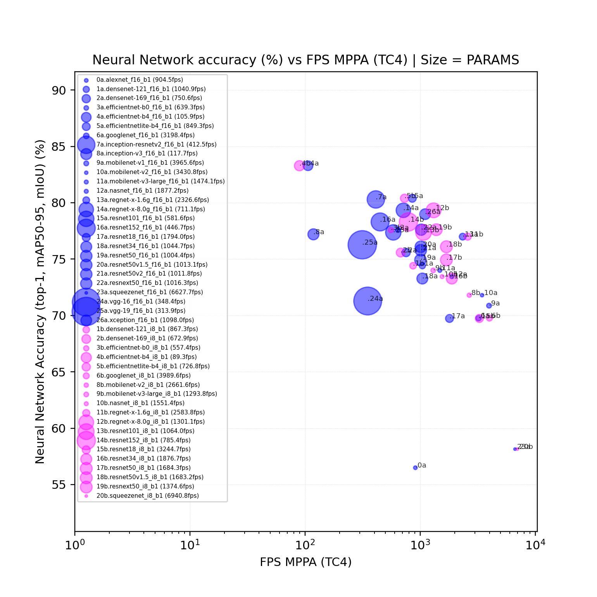

</a>

## List of Classification Neural Networks

This repository gives access to following classification neural networks by architecture:

* AlexNet, DenseNet, EfficientNet, Inception, MobileNet, NasNet, Resnet, RegNet, SqueezeNet, VGG

Find below, the neural networks listed according to their Top-1 accuracy vs MPPA performance in FPS (ACE 6.1.0):

<p align="center">
  </a></br>
  <i>Fig1. Neural network accuracy (top-1) [%] vs Device performance on TurboCard4 [Frame Per Seconds];</br>
    bubble size is relative to PARAMs model size; blue: FP16 models; magenta: INT8 quantized models</i></br>
</p>
Do not hesitate to see in detail the complete table below for all neural networks.

## Important notes

* Neural networks are available on our **Hugging face plateform** 🤗 [HERE](https://huggingface.co/Kalray).
  Do not hesitate to check model card for details of implementation, sources or license.

* All models have been trained on **ImageNet Large Scale Visual Recognition Challenge 2012**
  [ILSVRC2012](https://www.image-net.org/challenges/LSVRC/2012/) dataset

* To generate a neural network with KaNN :
  + in FP16, refer to ONNX model (pointed by `<model>_f16.yaml`)
  + in INT8/FP16, use QDQ-model (pointed by `<model>_i8.yaml`)
  + please see [WIKI.md](../../WIKI.md) for instructions on how to use any of these models

 > [!TIP]
 > Example of use:
>  ```bash
>  # Generate
>  kann generate ./networks/classifiers/regnet-x-1.6g/onnx/regnet_x_1_6_f16.yaml -d regnet-x-1.6g
>  # wait ...
>  # then, run
>  kann run regnet-x-1.6g
>  # observe the output to consider the global and detailed performance
>  ```

## Neural Networks

The models are listed below, according:
  + the accuracy metrics (TopK accuracy here for classifiers)
  + Performance is given at **batch 1** per MPPA in :
    * Frame per second from device point of view

*NB: MPPA Coolidge V2 processor default frequency is 1.0 GHz in ACE 6.1.0*

<!-- START AUTOMATED TABLE -->
| NAME                                                                                 |  FLOPs |   Params | accTop1 | accTop5 | Dtype |  Input  | 🤗 HF repo-id                                                                    | FPS(K300) | FPS(TC4) |
| :----------------------------------------------------------------------------------- | -----: | -------: | :-----: | :-----: | :---- | :-----: | :------------------------------------------------------------------------------ | --------: | -------: |
| [alexNet F16](./alexnet/onnx/alexnet_f16.yaml)                                       |  1.3 G |   60.9 M | 56.52 % | 79.06 % | FP16  | 224x224 | [Kalray/alexnet](huggingface.co/Kalray/alexnet)                                 |     226.1 |    904.4 |
| [denseNet-121 Q-INT8](./densenet-121/onnx/densenet_121_i8.yaml)                      |  5.7 G |   8.04 M | 74.43 % | 91.9 %  | QINT8 | 224x224 | [Kalray/densenet-121](https://huggingface.co/Kalray/densenet-121)               |     216.8 |    867.3 |
| [denseNet-121 F16](./densenet-121/onnx/densenet_121_f16.yaml)                        |  5.7 G |   8.04 M | 74.43 % | 91.97 % | FP16  | 224x224 | [Kalray/densenet-121](https://huggingface.co/Kalray/densenet-121)               |     260.2 |  1,040.9 |
| [denseNet-169 Q-INT8](./densenet-169/onnx/densenet_169_i8.yaml)                      |  6.7 G |  14.27 M | 75.6 %  | 92.8 %  | QINT8 | 224x224 | [Kalray/densenet-169](https://huggingface.co/Kalray/densenet-169)               |     168.2 |    672.8 |
| [denseNet-169 F16](./densenet-169/onnx/densenet_169_f16.yaml)                        |  6.7 G |  14.27 M | 75.6 %  | 92.81 % | FP16  | 224x224 | [Kalray/densenet-169](https://huggingface.co/Kalray/densenet-169)               |     187.6 |    750.6 |
| [efficientNet-B0 Q-INT8](./efficientnet-b0/onnx/efficientnet_b0_i8.yaml)             |  1.0 G |   5.26 M | 77.6 %  | 93.5 %  | QINT8 | 224x224 | [Kalray/efficientnet-b0](https://huggingface.co/Kalray/efficientnet-b0)         |     159.8 |    639.2 |
| [efficientNet-B0 F16](./efficientnet-b0/onnx/efficientnet_b0_f16.yaml)               |  1.0 G |   5.26 M | 77.69 % | 93.53 % | FP16  | 380x380 | [Kalray/efficientnet-b0](https://huggingface.co/Kalray/efficientnet-b0)         |     139.3 |    557.4 |
| [efficientNet-B4 Q-INT8](./efficientnet-b4/onnx/efficientnet_b4_i8.yaml)             | 11.7 G |  16.83 M | 83.3 %  | 96.5 %  | QINT8 | 380x380 | [Kalray/efficientnet-b4](https://huggingface.co/Kalray/efficientnet-b4)         |      22.3 |     89.2 |
| [efficientNet-B4 F16](./efficientnet-b4/onnx/efficientnet_b4_f16.yaml)               | 11.7 G |  16.83 M | 83.38 % | 96.59 % | FP16  | 224x224 | [Kalray/efficientnet-b4](https://huggingface.co/Kalray/efficientnet-b4)         |      26.4 |    105.8 |
| [efficientNetLite-B4 Q-INT8](./efficientnetlite-b4/onnx/efficientnetlite_b4_i8.yaml) |  2.7 G |  12.96 M | 80.4 %  |    -    | QINT8 | 224x224 | [Kalray/efficientNetLite-B4](https://huggingface.co/Kalray/efficientnetlite-b4) |     212.3 |    849.2 |
| [efficientNetLite-B4 F16](./efficientnetlite-b4/onnx/efficientnetlite_b4_f16.yaml)   |  2.7 G |  12.96 M | 80.4 %  |    -    | FP16  | 224x224 | [Kalray/efficientNetLite-B4](https://huggingface.co/Kalray/efficientnetlite-b4) |     181.7 |    726.8 |
| [googleNet Q-INT8](./googlenet/onnx/googlenet_i8.yaml)                               |  3.0 G |   6.62 M | 69.8 %  | 89.5 %  | QINT8 | 224x224 | [Kalray/googlenet](https://huggingface.co/Kalray/googlenet)                     |     997.3 |  3,989.5 |
| [googleNet F16](./googlenet/onnx/googlenet_f16.yaml)                                 |  3.0 G |   6.62 M | 69.8 %  | 89.5 %  | FP16  | 224x224 | [Kalray/googlenet](https://huggingface.co/Kalray/googlenet)                     |     799.5 |  3,198.3 |
| [inception-resnetv2 F16](./inception-resnetv2/onnx/inception_resnetv2_f16.yaml)      |  13. G |   55.9 M | 80.3 %  | 95.3 %  | FP16  | 229x229 | [Kalray/inception-resnetv2](https://huggingface.co/Kalray/inception-resnetv2)   |     103.1 |    412.5 |
| [inception-V3 Q-INT8](./inception-v3/onnx/inceptionv3_i8.yaml)                       |  11. G |  27.16 M | 77.2 %  | 93.4 %  | QINT8 | 299x299 | [Kalray/inception-v3](https://huggingface.co/Kalray/inception-v3)               |      29.4 |    117.7 |
| [mobileNet-V1 F16](./mobilenet-v1/onnx/mobilenet_v1_f16.yaml)                        |  1.1 G |   4.16 M | 70.9 %  | 89.9 %  | FP16  | 224x224 | [Kalray/mobilenet-v1](https://huggingface.co/Kalray/mobilenet-v1)               |     991.4 |  3,965.6 |
| [mobileNet-V2 Q-INT8](./mobilenet-v2/onnx/mobilenet_v2_i8.yaml)                      |  0.8 G |   3.54 M | 71.8 %  | 90.2 %  | QINT8 | 224x224 | [Kalray/mobilenet-v2](https://huggingface.co/Kalray/mobilenet-v2)               |     857.6 |  3,430.7 |
| [mobileNet-V2 F16](./mobilenet-v2/onnx/mobilenet_v2_f16.yaml)                        |  0.8 G |   3.54 M | 71.88 % | 90.29 % | FP16  | 224x224 | [Kalray/mobilenet-v2](https://huggingface.co/Kalray/mobilenet-v2)               |     665.4 |  2,661.6 |
| [mobileNet-V3-large Q-INT8](./mobilenet-v3-large/onnx/mobilenet_v3_large_i8.yaml)    |  0.4 G |   5.47 M | 74.0 %  | 91.3 %  | QINT8 | 224x224 | [Kalray/mobilenet-v3-large](https://huggingface.co/Kalray/mobilenet-v3-large)   |     368.5 |  1,474.0 |
| [mobileNet-V3-large F16](./mobilenet-v3-large/onnx/mobilenet_v3_large_f16.yaml)      |  0.4 G |   5.47 M | 74.04 % | 91.34 % | FP16  | 224x224 | [Kalray/mobilenet-v3-large](https://huggingface.co/Kalray/mobilenet-v3-large)   |     323.4 |  1,293.8 |
| [nasnet Q-INT8](./nasnet/onnx/nasnet_i8.yaml)                                        |  0.6 G |   4.36 M | 73.4 %  | 91.5 %  | QINT8 | 224x224 | [Kalray/nasnet](https://huggingface.co/Kalray/nasnet)                           |     387.8 |  1,551.3 |
| [nasnet F16](./nasnet/onnx/nasnet_f16.yaml)                                          |  0.6 G |   4.36 M | 73.45 % | 91.51 % | FP16  | 224x224 | [Kalray/nasnet](https://huggingface.co/Kalray/nasnet)                           |     469.2 |  1,877.1 |
| [regNet-x-1.6g Q-INT8](./regnet-x-1.6g/onnx/regnet_x_1_6g_i8.yaml)                   |  3.2 G |   9.17 M | 77.0 %  | 93.4 %  | QINT8 | 224x224 | [Kalray/regnet-x-1.6g](https://huggingface.co/Kalray/regnet-x-1.6g)             |     645.9 |  2,583.8 |
| [regNet-x-1.6g F16](./regnet-x-1.6g/onnx/regnet_x_1_6g_f16.yaml)                     |  3.2 G |   9.17 M | 77.04 % | 93.44 % | FP16  | 224x224 | [Kalray/regnet-x-1.6g](https://huggingface.co/Kalray/regnet-x-1.6g)             |     581.6 |  2,326.5 |
| [regNet-x-8.0g Q-INT8](./regnet-x-8.0g/onnx/regnet_x_8_0g_i8.yaml)                   | 16.0 G |  39.53 M | 79.3 %  | 94.6 %  | QINT8 | 224x224 | [Kalray/regnet-x-8.0g](https://huggingface.co/Kalray/regnet-x-8.0g)             |     325.2 |  1,301.0 |
| [regNet-x-8.0g F16](./regnet-x-8.0g/onnx/regnet_x_8_0g_f16.yaml)                     | 16.0 G |  39.53 M | 79.34 % | 94.68 % | FP16  | 224x224 | [Kalray/regnet-x-8.0g](https://huggingface.co/Kalray/regnet-x-8.0g)             |     177.7 |    711.1 |
| [resnet101 Q-INT8](./resnet101/onnx/resnet101_i8.yaml)                               | 15.2 G |  44.70 M | 77.3 %  | 93.5 %  | QINT8 | 224x224 | [Kalray/resnet101](https://huggingface.co/Kalray/resnet101)                     |     265.9 |  1,063.9 |
| [resnet101 F16](./resnet101/onnx/resnet101_f16.yaml)                                 | 15.2 G |  44.70 M | 77.37 % | 93.54 % | FP16  | 224x224 | [Kalray/resnet101](https://huggingface.co/Kalray/resnet101)                     |     145.3 |    581.5 |
| [resnet152 Q-INT8](./resnet152/onnx/resnet152_i8.yaml)                               | 22.6 G |   60.4 M | 78.3 %  | 94.0 %  | QINT8 | 224x224 | [Kalray/resnet152](https://huggingface.co/Kalray/resnet152)                     |     196.3 |    785.3 |
| [resnet152 F16](./resnet152/onnx/resnet152_f16.yaml)                                 | 22.6 G |   60.4 M | 78.31 % | 94.04 % | FP16  | 224x224 | [Kalray/resnet152](https://huggingface.co/Kalray/resnet152)                     |     111.6 |    446.7 |
| [resnet18 Q-INT8](./resnet18/onnx/resnet18_i8.yaml)                                  |  3.6 G |  11.70 M | 69.7 %  | 89.0 %  | QINT8 | 224x224 | [Kalray/resnet18](https://huggingface.co/Kalray/resnet18)                       |     811.1 |  3,244.7 |
| [resnet18 F16](./resnet18/onnx/resnet18_f16.yaml)                                    |  3.6 G |  11.70 M | 69.75 % | 89.07 % | FP16  | 224x224 | [Kalray/resnet18](https://huggingface.co/Kalray/resnet18)                       |     448.5 |  1,794.0 |
| [resnet34 Q-INT8](./resnet34/onnx/resnet34_i8.yaml)                                  |  7.3 G |  21.81 M | 73.3 %  | 91.4 %  | QINT8 | 224x224 | [Kalray/resnet34](https://huggingface.co/Kalray/resnet34)                       |     469.1 |  1,876.7 |
| [resnet34 F16](./resnet34/onnx/resnet34_f16.yaml)                                    |  7.3 G |  21.81 M | 73.31 % | 91.42 % | FP16  | 224x224 | [Kalray/resnet34](https://huggingface.co/Kalray/resnet34)                       |     261.1 |  1,044.6 |
| [resnet50 Q-INT8](./resnet50/onnx/resnet50_i8.yaml)                                  |  7.7 G |  25.63 M | 74.9 %  | 92.3 %  | QINT8 | 224x224 | [Kalray/resnet50](https://huggingface.co/Kalray/resnet50)                       |     251.1 |  1,004.4 |
| [resnet50 F16](./resnet50/onnx/resnet50_f16.yaml)                                    |  7.7 G |  25.63 M | 74.93 % | 92.38 % | FP16  | 224x224 | [Kalray/resnet50](https://huggingface.co/Kalray/resnet50)                       |     421.0 |  1,684.2 |
| [resnet50v1.5 Q-INT8](./resnet50v1.5/onnx/resnet50v1_5_i8.yaml)                      |  8.2 G |  25.53 M | 76.1 %  | 92.8 %  | QINT8 | 224x224 | [Kalray/resnet50v1.5](https://huggingface.co/Kalray/resnet50v1.5)               |     253.2 |  1,013.1 |
| [resnet50v1.5 F16](./resnet50v1.5/onnx/resnet50v1_5_f16.yaml)                        |  8.2 G |  25.53 M | 76.13 % | 92.86 % | FP16  | 224x224 | [Kalray/resnet50v1.5](https://huggingface.co/Kalray/resnet50v1.5)               |     420.8 |  1,683.2 |
| [resnet50v2 F16](./resnet50v2/onnx/resnet50v2_f16.yaml)                              |  8.2 G |   25.5 M | 75.81 % | 92.82 % | FP16  | 224x224 | [Kalray/resnet50v2](https://huggingface.co/Kalray/resnet50v2)                   |     252.9 |  1,011.7 |
| [resnext50 Q-INT8](./resnext50/onnx/resnext50_i8.yaml)                               |  8.4 G |   25.0 M | 77.6 %  | 93.6 %  | QINT8 | 224x224 | [Kalray/resnext50](https://huggingface.co/Kalray/resnext50)                     |     254.0 |  1,016.2 |
| [resnext50 F16](./resnext50/onnx/resnext50_f16.yaml)                                 |  8.4 G |   25.0 M | 77.62 % | 93.69 % | FP16  | 224x224 | [Kalray/resnext50](https://huggingface.co/Kalray/resnext50)                     |     343.6 |  1,374.5 |
| [squeezeNet Q-INT8](./squeezenet/onnx/squeezenet_i8.yaml)                            |  0.7 G |   1.23 M | 58.1 %  | 80.6 %  | QINT8 | 224x224 | [Kalray/squeezenet](https://huggingface.co/Kalray/squeezenet)                   |    1656.9 |  6,627.6 |
| [squeezeNet F16](./squeezenet/onnx/squeezenet_f16.yaml)                              |  0.7 G |   1.23 M | 58.17 % | 80.62 % | FP16  | 224x224 | [Kalray/squeezenet](https://huggingface.co/Kalray/squeezenet)                   |    1735.2 |  6,940.8 |
| [vgg-16 F16](./vgg-16/onnx/vgg_16_f16.yaml)                                          | 31.0 G | 138.36 M | 71.3 %  | 90.1 %  | FP16  | 224x224 | [Kalray/vgg-16](https://huggingface.co/Kalray/vgg-16)                           |      87.1 |    348.4 |
| [vgg-19 F16](./vgg-19/onnx/vgg_19_f16.yaml)                                          | 37.6 G |  12.85 M | 71.3 %  | 90.0 %  | FP16  | 224x224 | [Kalray/vgg-19](https://huggingface.co/Kalray/vgg-19)                           |      78.4 |    313.8 |
| [xception F16](./xception/onnx/xception_f16.yaml)                                    |   9. G |   22.9 M | 79.0 %  | 94.5 %  | FP16  | 229x229 | [Kalray/xception](https://huggingface.co/Kalray/xception)                       |     274.5 |  1,098.0 |
<!-- END AUTOMATED TABLE -->
