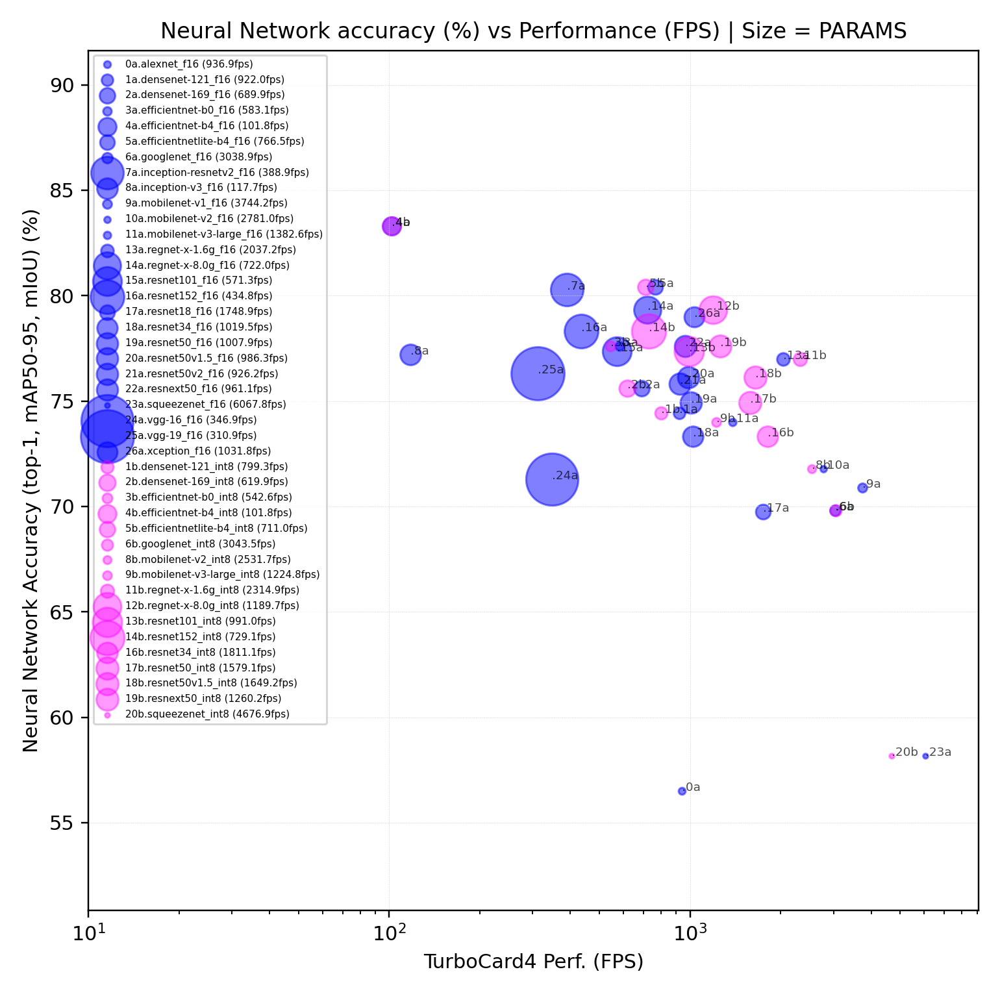

</a>

## List of Classification Neural Networks

This repository gives access to following classification neural networks by architecture:

* DenseNet, EfficientNet, Inception, MobileNet, NasNet, Resnet, RegNet, SqueezeNet, VGG

Please find below, the neural networks listed according to their Top-1 accuracy vs
MPPA performance in FPS (ACE 6.0.0):

<p align="center">
  </a></br>
  <i>Fig1. Neural network accuracy (top-1) [%] vs Device performance in [FPS];</br>
    bubble size is relative to PARAMs model size; blue: FP16 models; magenta: INT8 quantized models </i>
</p>
Do not hesitate to see in detail the complete table below for all neural networks.

## Important notes

* Neural networks are available on our **Hugging face plateform** 🤗 [HERE](https://huggingface.co/Kalray).
  Do not hesitate to check model card for details of implementation, sources or license.

* All models have been trained on **ImageNet Large Scale Visual Recognition Challenge 2012**
  [ILSVRC2012](https://www.image-net.org/challenges/LSVRC/2012/) dataset

* To generate a neural network with KaNN :
  + in FP16, refer to ONNX model (pointed by network_f16.yaml)
  + in INT8/FP16, use QDQ-model (pointed by network_i8.yaml)
  + please see [WIKI.md](../../WIKI.md) for instructions on how to use any of these models

  Example of use:
  ```bash
  # Generate
  kann generate ./networks/classifiers/regnet-x-1.6g/onnx/network_f16.yaml -d regnet-x-1.6g
  # wait ...
  # then, run
  kann run regnet-x-1.6g
  # observe the output to consider the global and detailed performance
  ```

## Neural Networks

The models are listed below, according:
  + the accuracy metrics (TopK accuracy here for classifiers)
  + MPPA performance at **batch 1** in :
    * Frames per second from MPPA device

*NB: MPPA Coolidge V2 processor default frequency is 1.0 GHz in ACE 6.0.0*

<!-- START AUTOMATED TABLE -->
| NAME                                                                     |  FLOPs   |  Params  | accTop1 | accTop5 | Dtype |  Input  | 🤗 HF repo-id                                                                    | FPS (MPPA) |
| :----------------------------------------------------------------------- | :------: | :------: | :-----: | :-----: | :---- | :-----: | :------------------------------------------------------------------------------ | --------: |
| [alexNet F16](./alexnet/onnx/network_f16.yaml)                           | 1.335 G  |  60.9 M  | 56.52 % | 79.06 % | FP16  | 224x224 | [Kalray/alexnet](huggingface.co/Kalray/alexnet)                                 |     234.2 |
| [denseNet-121 Q-INT8](./densenet-121/onnx/network_i8.yaml)               | 5.718 G  |  8.04 M  | 74.43 % | 91.9 %  | QINT8 | 224x224 | [Kalray/densenet-121](https://huggingface.co/Kalray/densenet-121)               |     199.8 |
| [denseNet-121 F16](./densenet-121/onnx/network_f16.yaml)                 | 5.718 G  |  8.04 M  | 74.43 % | 91.97 % | FP16  | 224x224 | [Kalray/densenet-121](https://huggingface.co/Kalray/densenet-121)               |     230.5 |
| [denseNet-169 Q-INT8](./densenet-169/onnx/network_i8.yaml)               | 6.777 G  | 14.27 M  | 75.6 %  | 92.8 %  | QINT8 | 224x224 | [Kalray/densenet-169](https://huggingface.co/Kalray/densenet-169)               |     154.9 |
| [denseNet-169 F16](./densenet-169/onnx/network_f16.yaml)                 | 6.777 G  | 14.27 M  | 75.6 %  | 92.81 % | FP16  | 224x224 | [Kalray/densenet-169](https://huggingface.co/Kalray/densenet-169)               |     172.4 |
| [efficientNet-B0 Q-INT8](./efficientnet-b0/onnx/network_i8.yaml)         | 1.004 G  |  5.26 M  | 77.6 %  | 93.5 %  | QINT8 | 224x224 | [Kalray/efficientnet-b0](https://huggingface.co/Kalray/efficientnet-b0)         |     135.6 |
| [efficientNet-B0 F16](./efficientnet-b0/onnx/network_f16.yaml)           | 1.004 G  |  5.26 M  | 77.69 % | 93.53 % | FP16  | 224x224 | [Kalray/efficientnet-b0](https://huggingface.co/Kalray/efficientnet-b0)         |     145.7 |
| [efficientNet-B4 Q-INT8](./efficientnet-b4/onnx/network_i8.yaml)         | 11.727 G | 16.83 M  | 83.3 %  | 96.5 %  | QINT8 | 224x224 | [Kalray/efficientnet-b4](https://huggingface.co/Kalray/efficientnet-b4)         |      24.9 |
| [efficientNet-B4 F16](./efficientnet-b4/onnx/network_f16.yaml)           | 11.727 G | 16.83 M  | 83.38 % | 96.59 % | FP16  | 224x224 | [Kalray/efficientnet-b4](https://huggingface.co/Kalray/efficientnet-b4)         |      25.4 |
| [efficientNetLite-B4 Q-INT8](./efficientnetlite-b4/onnx/network_i8.yaml) | 2.785 G  | 12.96 M  | 80.4 %  |    -    | QINT8 | 224x224 | [Kalray/efficientNetLite-B4](https://huggingface.co/Kalray/efficientnetlite-b4) |     177.7 |
| [efficientNetLite-B4 F16](./efficientnetlite-b4/onnx/network_f16.yaml)   | 2.785 G  | 12.96 M  | 80.4 %  |    -    | FP16  | 224x224 | [Kalray/efficientNetLite-B4](https://huggingface.co/Kalray/efficientnetlite-b4) |     191.6 |
| [googleNet Q-INT8](./googlenet/onnx/network_i8.yaml)                     | 3.014 G  |  6.62 M  | 69.8 %  | 89.5 %  | QINT8 | 224x224 | [Kalray/googlenet](https://huggingface.co/Kalray/googlenet)                     |     760.8 |
| [googleNet F16](./googlenet/onnx/network_f16.yaml)                       | 3.014 G  |  6.62 M  | 69.8 %  | 89.5 %  | FP16  | 224x224 | [Kalray/googlenet](https://huggingface.co/Kalray/googlenet)                     |     759.7 |
| [inception-resnetv2 F16](./inception-resnetv2/onnx/network_f16.yaml)     | 13.27 G  |  55.9 M  | 80.3 %  | 95.3 %  | FP16  | 229x229 | [Kalray/inception-resnetv2](https://huggingface.co/Kalray/inception-resnetv2)   |      97.2 |
| [inception-V3 F16](./inception-v3/onnx/network_f16.yaml)                 | 11.42 G  | 27.16 M  | 77.2 %  | 93.4 %  | FP16  | 299x299 | [Kalray/inception-v3](https://huggingface.co/Kalray/inception-v3)               |      29.4 |
| [mobileNet-V1 F16](./mobilenet-v1/onnx/network_f16.yaml)                 | 1.124 G  |  4.16 M  | 70.9 %  | 89.9 %  | FP16  | 224x224 | [Kalray/mobilenet-v1](https://huggingface.co/Kalray/mobilenet-v1)               |     936.0 |
| [mobileNet-V2 Q-INT8](./mobilenet-v2/onnx/network_i8.yaml)               | 0.893 G  |  3.54 M  | 71.8 %  | 90.2 %  | QINT8 | 224x224 | [Kalray/mobilenet-v2](https://huggingface.co/Kalray/mobilenet-v2)               |     632.9 |
| [mobileNet-V2 F16](./mobilenet-v2/onnx/network_f16.yaml)                 | 0.893 G  |  3.54 M  | 71.88 % | 90.29 % | FP16  | 224x224 | [Kalray/mobilenet-v2](https://huggingface.co/Kalray/mobilenet-v2)               |     695.2 |
| [mobileNet-V3-large Q-INT8](./mobilenet-v3-large/onnx/network_i8.yaml)   | 0.465 G  |  5.47 M  | 74.0 %  | 91.3 %  | QINT8 | 224x224 | [Kalray/mobilenet-v3-large](https://huggingface.co/Kalray/mobilenet-v3-large)   |     306.1 |
| [mobileNet-V3-large F16](./mobilenet-v3-large/onnx/network_f16.yaml)     | 0.465 G  |  5.47 M  | 74.04 % | 91.34 % | FP16  | 224x224 | [Kalray/mobilenet-v3-large](https://huggingface.co/Kalray/mobilenet-v3-large)   |     345.6 |
| [regNet-x-1.6g Q-INT8](./regnet-x-1.6g/onnx/network_i8.yaml)             | 3.240 G  |  9.17 M  | 77.0 %  | 93.4 %  | QINT8 | 224x224 | [Kalray/regnet-x-1.6g](https://huggingface.co/Kalray/regnet-x-1.6g)             |     578.7 |
| [regNet-x-1.6g F16](./regnet-x-1.6g/onnx/network_f16.yaml)               | 3.240 G  |  9.17 M  | 77.04 % | 93.44 % | FP16  | 224x224 | [Kalray/regnet-x-1.6g](https://huggingface.co/Kalray/regnet-x-1.6g)             |     509.3 |
| [regNet-x-8.0g Q-INT8](./regnet-x-8.0g/onnx/network_i8.yaml)             | 16.052 G | 39.53 M  | 79.3 %  | 94.6 %  | QINT8 | 224x224 | [Kalray/regnet-x-8.0g](https://huggingface.co/Kalray/regnet-x-8.0g)             |     297.4 |
| [regNet-x-8.0g F16](./regnet-x-8.0g/onnx/network_f16.yaml)               | 16.052 G | 39.53 M  | 79.34 % | 94.68 % | FP16  | 224x224 | [Kalray/regnet-x-8.0g](https://huggingface.co/Kalray/regnet-x-8.0g)             |     180.5 |
| [resnet101 Q-INT8](./resnet101/onnx/network_i8.yaml)                     | 15.221 G | 44.70 M  | 77.3 %  | 93.5 %  | QINT8 | 224x224 | [Kalray/resnet101](https://huggingface.co/Kalray/resnet101)                     |     247.7 |
| [resnet101 F16](./resnet101/onnx/network_f16.yaml)                       | 15.221 G | 44.70 M  | 77.37 % | 93.54 % | FP16  | 224x224 | [Kalray/resnet101](https://huggingface.co/Kalray/resnet101)                     |     142.8 |
| [resnet152 Q-INT8](./resnet152/onnx/network_i8.yaml)                     | 22.680 G |  60.4 M  | 78.3 %  | 94.0 %  | QINT8 | 224x224 | [Kalray/resnet152](https://huggingface.co/Kalray/resnet152)                     |     182.2 |
| [resnet152 F16](./resnet152/onnx/network_f16.yaml)                       | 22.680 G |  60.4 M  | 78.31 % | 94.04 % | FP16  | 224x224 | [Kalray/resnet152](https://huggingface.co/Kalray/resnet152)                     |     108.6 |
| [resnet18 Q-INT8](./resnet18/onnx/network_i8.yaml)                       | 3.642 G  | 11.70 M  | 69.7 %  | 89.0 %  | QINT8 | 224x224 | [Kalray/resnet18](https://huggingface.co/Kalray/resnet18)                       |     761.1 |
| [resnet18 F16](./resnet18/onnx/network_f16.yaml)                         | 3.642 G  | 11.70 M  | 69.75 % | 89.07 % | FP16  | 224x224 | [Kalray/resnet18](https://huggingface.co/Kalray/resnet18)                       |     437.2 |
| [resnet34 Q-INT8](./resnet34/onnx/network_i8.yaml)                       | 7.348 G  | 21.81 M  | 73.3 %  | 91.4 %  | QINT8 | 224x224 | [Kalray/resnet34](https://huggingface.co/Kalray/resnet34)                       |     452.7 |
| [resnet34 F16](./resnet34/onnx/network_f16.yaml)                         | 7.348 G  | 21.81 M  | 73.31 % | 91.42 % | FP16  | 224x224 | [Kalray/resnet34](https://huggingface.co/Kalray/resnet34)                       |     254.8 |
| [resnet50 Q-INT8](./resnet50/onnx/network_i8.yaml)                       | 7.770 G  | 25.63 M  | 74.9 %  | 92.3 %  | QINT8 | 224x224 | [Kalray/resnet50](https://huggingface.co/Kalray/resnet50)                       |     394.7 |
| [resnet50 F16](./resnet50/onnx/network_f16.yaml)                         | 7.770 G  | 25.63 M  | 74.93 % | 92.38 % | FP16  | 224x224 | [Kalray/resnet50](https://huggingface.co/Kalray/resnet50)                       |     251.9 |
| [resnet50v1.5 Q-INT8](./resnet50v1.5/onnx/network_i8.yaml)               | 8.234 G  | 25.53 M  | 76.1 %  | 92.8 %  | QINT8 | 224x224 | [Kalray/resnet50v1.5](https://huggingface.co/Kalray/resnet50v1.5)               |     412.3 |
| [resnet50v1.5 F16](./resnet50v1.5/onnx/network_f16.yaml)                 | 8.234 G  | 25.53 M  | 76.13 % | 92.86 % | FP16  | 224x224 | [Kalray/resnet50v1.5](https://huggingface.co/Kalray/resnet50v1.5)               |     246.5 |
| [resnet50v2 F16](./resnet50v2/onnx/network_f16.yaml)                     | 8.209 G  |  25.5 M  | 75.81 % | 92.82 % | FP16  | 224x224 | [Kalray/resnet50v2](https://huggingface.co/Kalray/resnet50v2)                   |     231.5 |
| [resnext50 Q-INT8](./resnext50/onnx/network_i8.yaml)                     | 8.436 G  |  25.0 M  | 77.6 %  | 93.6 %  | QINT8 | 224x224 | [Kalray/resnext50](https://huggingface.co/Kalray/resnext50)                     |     315.0 |
| [resnext50 F16](./resnext50/onnx/network_f16.yaml)                       | 8.436 G  |  25.0 M  | 77.62 % | 93.69 % | FP16  | 224x224 | [Kalray/resnext50](https://huggingface.co/Kalray/resnext50)                     |     240.2 |
| [squeezeNet Q-INT8](./squeezenet/onnx/network_i8.yaml)                   | 0.714 G  |  1.23 M  | 58.1 %  | 80.6 %  | QINT8 | 224x224 | [Kalray/squeezenet](https://huggingface.co/Kalray/squeezenet)                   |    1169.2 |
| [squeezeNet F16](./squeezenet/onnx/network_f16.yaml)                     | 0.714 G  |  1.23 M  | 58.17 % | 80.62 % | FP16  | 224x224 | [Kalray/squeezenet](https://huggingface.co/Kalray/squeezenet)                   |    1516.9 |
| [vgg-16 F16](./vgg-16/onnx/network_f16.yaml)                             | 31.006 G | 138.36 M | 71.3 %  | 90.1 %  | FP16  | 224x224 | [Kalray/vgg-16](https://huggingface.co/Kalray/vgg-16)                           |      86.7 |
| [vgg-19 F16](./vgg-19/onnx/network_f16.yaml)                             | 37.683 G | 12.85 M  | 71.3 %  | 90.0 %  | FP16  | 224x224 | [Kalray/vgg-19](https://huggingface.co/Kalray/vgg-19)                           |      77.7 |
| [xception F16](./xception/onnx/network_f16.yaml)                         |  9.07 G  |  22.9 M  | 79.0 %  | 94.5 %  | FP16  | 229x229 | [Kalray/xception](https://huggingface.co/Kalray/xception)                       |     257.9 |
<!-- END AUTOMATED TABLE -->
