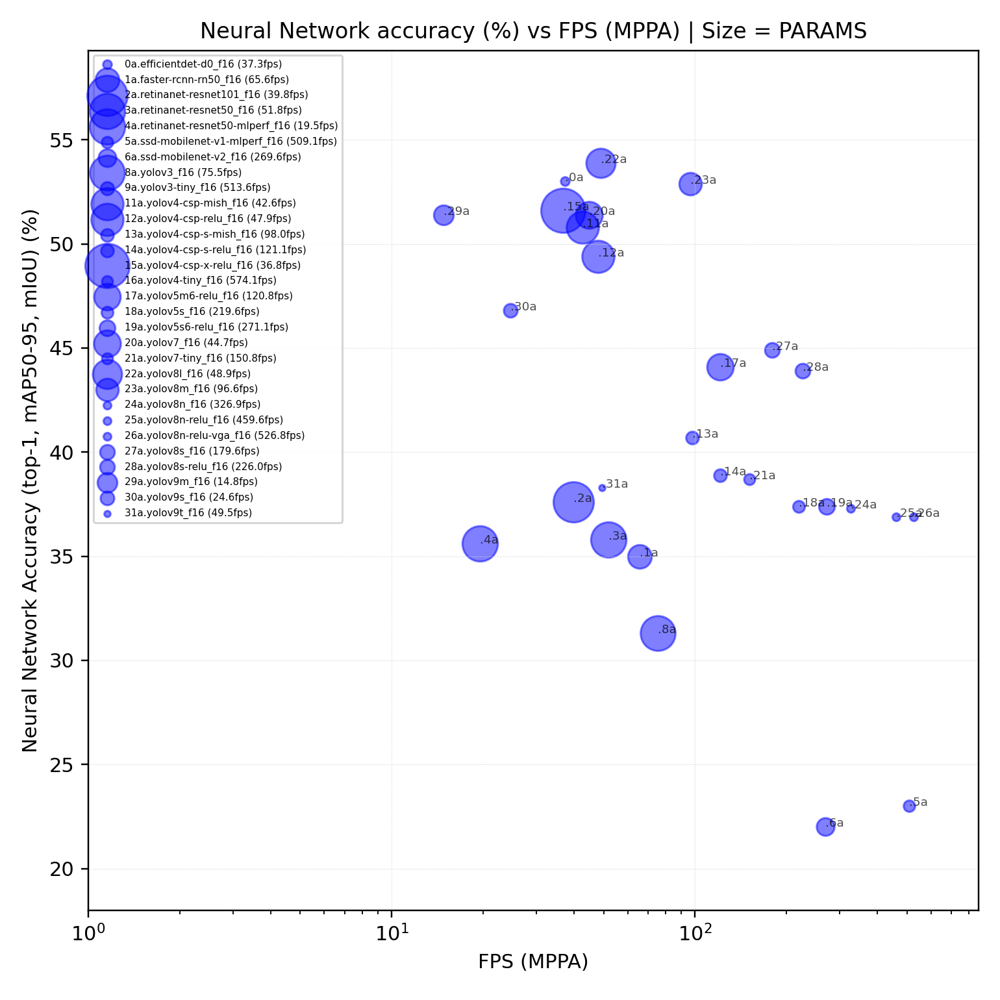

</a>

## List of Object Detection Neural Networks

This repository gives access to following object dectection neural networks main architecture:

* EfficientDet, RetinatNet, SSD, YOLO

Please find below, the neural networks listed according to their mAP50-95 accuracy vs
Device performance in FPS at BATCH=1 / MPPA (ACE 6.0.0):

<p align="center">
  </a>
  <i><b>Fig2.</b> Neural network accuracy (mAP50/95) [%] vs Device performance [FPS]at batch 1 / MPPA;</br>
    bubble size is relative to PARAMs model size; blue: FP16 models</i>
</p>
Do not hesitate to see in detail the complete table below for all neural networks.

## Important notes

* Neural networks are available on our **Hugging face plateform** 🤗 [HERE](https://huggingface.co/Kalray).
  Do not hesitate to check model cards for details of implementation, sources and/or license.

* All models have been trained on: **[COCO2017](https://cocodataset.org/#detection-2017) dataset**

* To generate a neural network with KaNN :
  + in FP16, refer to ONNX model (pointed by network_f16.yaml)
  + Please see [WIKI.md](../../WIKI.md) for instructions on how to use any of these models

  Example of use:
  ```bash
  # Generate
  kann generate ./networks/object-detection/yolov8n/onnx/network_f16.yaml -d yolov8n
  # wait ...
  # then, run
  kann run yolov8n
  # observe the output to consider the global and detailed performance
  ```

## Neural Networks

The models are listed below, according:
  + The accuracy metrics (mAP50 and mAP50/95 for object-detection)
  + Performance is given at **batch 1** per MPPA in :
    * Frame per second from device point of view

See more about our products here: [Coolidge2, K300, TC4](../../README.md#acceleration-cards)

<!-- START AUTOMATED TABLE -->
| NAME                                                                                         |   FLOPs |  Params | mAP-50 | mAP-50/95 | Dtype |   Input   | 🤗 HF repo-id                                                                                  | FPS(K300) | FPS(TC4) |
| :------------------------------------------------------------------------------------------- | ------: | ------: | :----: | :-------: | :---: | :-------: | :-------------------------------------------------------------------------------------------- | --------: | -------: |
| [EfficientDet-D0](./efficientdet-d0/onnx/efficientdet_d0_f16.yaml)                           |  10.2 G |   3.9 M | 60.0 % |  44.1 %*  | FP16  |  512x512  | [Kalray/efficientdet-d0](https://huggingface.co/Kalray/efficientdet-d0)                       |      35.9 |    143.8 |
| [RetinaNet-resnet101](./retinanet-resnet101/onnx/retinanet_resnet101_f16.yaml)               | 161.4 G |  56.9 M | 45.0 % |  24.8 %*  | FP16  |  512x512  | [Kalray/retinanet-resnet101](https://huggingface.co/Kalray/retinanet-resnet101)               |      50.2 |    200.9 |
| [RetinaNet-resnet50](./retinanet-resnet50/onnx/retinanet_resnet50_f16.yaml)                  | 122.4 G |  37.9 M | 42.4 % |  23.2 %*  | FP16  |  512x512  | [Kalray/retinanet-resnet50](https://huggingface.co/Kalray/retinanet-resnet50)                 |      16.9 |     67.8 |
| [RetinaNet-resnext50 MLPERF](./retinanet-resnext50-mlperf/onnx/retinanet_resnext50_f16.yaml) | 299.6 G |  37.9 M |   -    |  35.6 %   | FP16  |  800x800  | [Kalray/retinanet-resnext50-mlperf](https://huggingface.co/Kalray/retinanet-resnext50-mlperf) |      39.5 |    158.1 |
| [SSD-mobileNetV1 MLPERF](./ssd-mobilenet-v1-mlperf/onnx/ssd_mobilenet_v1_f16.yaml)           |  2.45 G |   6.7 M | 53.0 % |  36.1 %*  | FP16  |  300x300  | [Kalray/ssd-mobilenet-v1-mlperf](https://huggingface.co/Kalray/ssd-mobilenet-v1-mlperf)       |     542.3 |  2,169.3 |
| [SSD-mobileNetV2](./ssd-mobilenet-v2/onnx/ssd_mobilenet_v2_f16.yaml)                         |  3.71 G |  16.1 M | 53.7 % |  36.8 %*  | FP16  |  300x300  | [Kalray/ssd-mobilenet-v2](https://huggingface.co/Kalray/ssd-mobilenet-v2)                     |     308.6 |  1,234.4 |
| [SSD-resnet34 MLPERF](./ssd-resnet34-mlperf/onnx/ssd_resnet34_f16.yaml)                      | 433.1 G |  20.0 M | 31.0 % |  16.4 %*  | FP16  | 1200x1200 | [Kalray/ssd-resnet34-mlperf](https://huggingface.co/Kalray/ssd-resnet34-mlperf)               |      15.2 |     61.0 |
| [YOLOv3](./yolov3/onnx/yolov3_f16.yaml)                                                      | 65.93 G |  61.9 M | 58.2 % |  40.4 %*  | FP16  |  416x416  | [YOLOv3](https://huggingface.co/Kalray/yolov3)                                                |      81.3 |    325.2 |
| [YOLOv3-Tiny](./yolov3/onnx/yolov3_tiny_f16.yaml)                                            |  5.58 G |   8.9 M | 29.9 % |  16.1 %*  | FP16  |  416x416  | [YOLOv3-tiny](https://huggingface.co/Kalray/yolov3)                                           |     533.2 |  2,132.8 |
| [YOLOv4](./yolov4/onnx/yolov4_f16.yaml)                                                      | 142.8 G |   64.3M | 65.4 % |  48.3 %*  | FP16  |  640x640  | [YOLOv4](https://huggingface.co/Kalray/yolov4)                                                |      27.4 |    109.8 |
| [YOLOv4-Tiny](./yolov4/onnx/yolov4_tiny_f16.yaml)                                            |  16.3 G |   6.1 M | 31.9 % |  13.8 %*  | FP16  |  640x640  | [YOLOv4-tiny](https://huggingface.co/Kalray/yolov4)                                           |     324.5 |  1,298.1 |
| [YOLOv5nu](./yolov5/onnx/yolov5nu_f16.yaml)                                                  |   8.0 G |   2.6 M | 48.9 % |  34.4 %*  | FP16  |  640x640  | [YOLOv5nu](https://huggingface.co/Kalray/yolov5)                                              |     359.4 |  1,437.6 |
| [YOLOv5su](./yolov5/onnx/yolov5su_f16.yaml)                                                  |  24.4 G |   9.1 M | 58.9 % |  43.1 %*  | FP16  |  640x640  | [YOLOv5su](https://huggingface.co/Kalray/yolov5)                                              |     209.3 |    837.3 |
| [YOLOv5su-ReLU](./yolov5/onnx/yolov5su_relu_f16.yaml)                                        |  24.4 G |   9.1 M | 54.7 % |  39.0 %*  | FP16  |  640x640  | [YOLOv5su-ReLU](https://huggingface.co/Kalray/yolov5)                                         |     242.8 |    971.4 |
| [YOLOv5mu](./yolov5/onnx/yolov5mu_f16.yaml)                                                  |  64.9 G |  25.0 M | 65.0 % |  49.3 %*  | FP16  |  640x640  | [YOLOv5mu](https://huggingface.co/Kalray/yolov5)                                              |     107.3 |    429.2 |
| [YOLOv5lu](./yolov5/onnx/yolov5lu_f16.yaml)                                                  | 136.1 G |  53.1 M | 68.2%  |  52.3 %*  | FP16  |  640x640  | [YOLOv5lu](https://huggingface.co/Kalray/yolov5)                                              |      53.2 |    212.8 |
| [YOLOv5xu](./yolov5/onnx/yolov5xu_f16.yaml)                                                  | 248.0 G |  97.1 M | 69.3 % |  53.7 %*  | FP16  |  640x640  | [YOLOv5xu](https://huggingface.co/Kalray/yolov5)                                              |      36.0 |    144.2 |
| [YOLOv7](./yolov7/onnx/yolov7_f16.yaml)                                                      | 107.8 G |  36.9 M | 68.5 % |  51.5 %*  | FP16  |  640x640  | [YOLOv7](https://huggingface.co/Kalray/yolov7)                                                |      49.7 |    198.8 |
| [YOLOv7-Tiny](./yolov7/onnx/yolov7_tiny_f16.yaml)                                            |  13.7 G |   6.2 M | 53.6 % |  37.2 %*  | FP16  |  640x640  | [YOLOv7-](https://huggingface.co/Kalray/yolov7)                                               |     178.4 |    713.8 |
| [YOLOv8n](./yolov8/onnx/yolov8n_f16.yaml)                                                    |   9.0 G |   3.1 M | 51.6 % |  37.3 %*  | FP16  |  640x640  | [YOLOv8n](https://huggingface.co/Kalray/yolov8)                                               |     356.1 |  1,424.6 |
| [YOLOv8s](./yolov8/onnx/yolov8s_f16.yaml)                                                    |  29.0 G |  11.1 M | 60.8 % |  45.1 %*  | FP16  |  640x640  | [YOLOv8s](https://huggingface.co/Kalray/yolov8)                                               |     196.0 |    784.2 |
| [YOLOv8s-ReLU](./yolov8/onnx/yolov8s_relu_f16.yaml)                                          |  28.7 G |  11.1 M | 57.3 % |  41.6 %*  | FP16  |  640x640  | [YOLOv8s-ReLU](https://huggingface.co/Kalray/yolov8)                                          |     218.6 |    874.5 |
| [YOLOv8m](./yolov8/onnx/yolov8m_f16.yaml)                                                    |  79.7 G |  25.8 M | 66.2 % |  50.5 %*  | FP16  |  640x640  | [YOLOv8m](https://huggingface.co/Kalray/yolov8)                                               |     102.0 |    408.0 |
| [YOLOv8l](./yolov8/onnx/yolov8l_f16.yaml)                                                    | 166.2 G |  43.6 M | 69.0 % |  53.4 %*  | FP16  |  640x640  | [YOLOv8l](https://huggingface.co/Kalray/yolov8)                                               |      52.4 |    209.6 |
| [YOLOv8x](./yolov8/onnx/yolov8x_f16.yaml)                                                    | 259.2 G |  68.1 M | 69.9 % |  54.3 %*  | FP16  |  640x640  | [YOLOv8x](https://huggingface.co/Kalray/yolov8)                                               |      39.5 |    158.0 |
| [YOLOv9t](./yolov9/onnx/yolov9t_f16.yaml)                                                    |   8.6 G |  2.0  M | 53.1 % |  38.3 %*  | FP16  |  640x640  | [YOLOv9t](https://huggingface.co/Kalray/yolov9)                                               |      55.8 |    223.2 |
| [YOLOv9s](./yolov9/onnx/yolov9s_f16.yaml)                                                    |  27.5 G |  7.1  M | 63.4 % |  46.8 %*  | FP16  |  640x640  | [YOLOv9s](https://huggingface.co/Kalray/yolov9)                                               |      29.8 |    119.2 |
| [YOLOv9m](./yolov9/onnx/yolov9m_f16.yaml)                                                    |  77.9 G | 20.0  M | 68.1 % |  51.4 %*  | FP16  |  640x640  | [YOLOv9m](https://huggingface.co/Kalray/yolov9)                                               |      15.4 |     61.8 |
| [YOLOv9c](./yolov9/onnx/yolov9c_f16.yaml)                                                    | 104.0 G | 25.3  M | 70.2 % |  53.0 %*  | FP16  |  640x640  | [YOLOv9c](https://huggingface.co/Kalray/yolov9)                                               |       9.2 |     37.0 |
| [YOLOv10n](./yolov10/onnx/yolo10n_f16.yaml)                                                  |   8.4 G |   2.2 M | 54.8 % |  39.9 %*  | FP16  |  640x640  | [YOLOv10n](https://huggingface.co/Kalray/yolov10)                                             |     255.6 |  1,022.5 |
| [YOLOv10s](./yolov10/onnx/yolo10s_f16.yaml)                                                  |  24.9 G |   7.1 M | 63.6 % |  47.4 %*  | FP16  |  640x640  | [YOLOv10s](https://huggingface.co/Kalray/yolov10)                                             |     159.3 |    637.2 |
| [YOLOv10m](./yolov10/onnx/yolo10m_f16.yaml)                                                  |  62.7 G |  15.2 M | 68.1 % |  52.1 %*  | FP16  |  640x640  | [YOLOv10m](https://huggingface.co/Kalray/yolov10)                                             |     101.0 |    404.1 |
| [YOLOv10l](./yolov10/onnx/yolo10l_f16.yaml)                                                  | 124.3 G |  24.1 M | 70.0 % |  54.1 %*  | FP16  |  640x640  | [YOLOv10l](https://huggingface.co/Kalray/yolov10)                                             |      56.3 |    225.2 |
| [YOLOv10x](./yolov10/onnx/yolo10x_f16.yaml)                                                  | 165.3 G |  29.1 M | 71.0 % |  55.1 %*  | FP16  |  640x640  | [YOLOv10x](https://huggingface.co/Kalray/yolov10)                                             |      45.1 |    180.5 |
| [YOLOv11n](./yolo11/onnx/yolo11n_f16.yaml)                                                   |   8.2 G |   2.6 M | 54.2 % |  39.4 %*  | FP16  |  640x640  | [YOLOv11n](https://huggingface.co/Kalray/yolo11)                                              |     283.4 |  1,133.7 |
| [YOLOv11s](./yolo11/onnx/yolo11s_f16.yaml)                                                   |  24.8 G |   9.4 M | 62.8 % |  47.0 %*  | FP16  |  640x640  | [YOLOv11s](https://huggingface.co/Kalray/yolo11)                                              |     178.2 |    712.8 |
| [YOLOv11s-ReLU](./yolo11/onnx/yolo11_relu_f16.yaml)                                          |  24.5 G |   9.4 M | 58.0 % |  42.3 %*  | FP16  |  640x640  | [YOLOv11s-ReLU](https://huggingface.co/Kalray/yolo11)                                         |     206.6 |    826.6 |
| [YOLOv11s-ReLU](./yolo11/onnx/yolo11_relu_i8.yaml)                                           |  24.4 G |   9.4 M | 57.6 % |  41.8 %*  | INT8  |  640x640  | [YOLOv11s-ReLU](https://huggingface.co/Kalray/yolo11)                                         |     146.8 |    587.4 |
| [YOLOv11m](./yolo11/onnx/yolo11m_f16.yaml)                                                   |  71.9 G |  20.0 M | 67.6 % |  51.9 %*  | FP16  |  640x640  | [YOLOv11m](https://huggingface.co/Kalray/yolo11)                                              |      87.5 |    350.3 |
| [YOLOv11l](./yolo11/onnx/yolo11l_f16.yaml)                                                   |  94.1 G |  25.2 M | 69.0 % |  53.7 %*  | FP16  |  640x640  | [YOLOv11l](https://huggingface.co/Kalray/yolo11)                                              |      66.9 |    267.7 |
| [YOLOv11x](./yolo11/onnx/yolo11x_f16.yaml)                                                   | 205.6 G |  56.8 M | 70.8 % |  55.3 %*  | FP16  |  640x640  | [YOLOv11x](https://huggingface.co/Kalray/yolo11)                                              |      29.5 |    118.1 |
<!-- END AUTOMATED TABLE -->
*NB: MPPA Coolidge V2 processor default frequency is 1.0 GHz in ACE 6.0.0*
