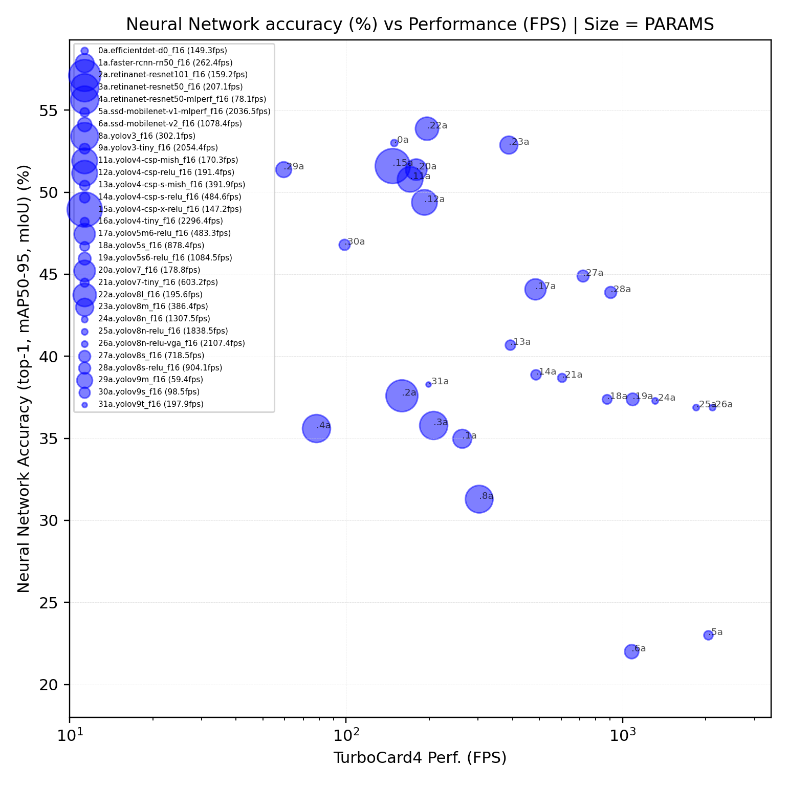

</a>

## List of Object Detection Neural Networks

This repository gives access to following object dectection neural networks main architecture:

* EfficientDet, RetinatNet, SSD, YOLO

Please find below, the neural networks listed according to their mAP50-95 accuracy vs
Device performance in FPS at BATCH=1 / MPPA (ACE 6.0.0):

<p align="center">
  </a>
  <i><b>Fig2.</b> Neural network accuracy (mAP50/95) [%] vs Device performance [FPS]at batch 1 / MPPA;</br>
    bubble size is relative to PARAMs model size; blue: FP16 models</i>
</p>
Do not hesitate to see in detail the complete table below for all neural networks.

## Important notes

* Neural networks are available on our **Hugging face plateform** 🤗 [HERE](https://huggingface.co/Kalray).
  Do not hesitate to check model cards for details of implementation, sources and/or license.

* All models have been trained on: **[COCO2017](https://cocodataset.org/#detection-2017) dataset**

* To generate a neural network with KaNN :
  + in FP16, refer to ONNX model (pointed by network_f16.yaml)
  + Please see [WIKI.md](../../WIKI.md) for instructions on how to use any of these models

  Example of use:
  ```bash
  # Generate
  kann generate ./networks/object-detection/yolov8n/onnx/network_f16.yaml -d yolov8n
  # wait ...
  # then, run
  kann run yolov8n
  # observe the output to consider the global and detailed performance
  ```

## Neural Networks

The models are listed below, according:
  + The accuracy metrics (mAP50 and mAP50/95 for object-detection)
  + Performance is given at **batch 1** per MPPA in :
    * Frame per second from device point of view

See more about our products here: [Coolidge2, K300, TC4](../../README.md#acceleration-cards)

<!-- START AUTOMATED TABLE -->
| NAME                                                                             |   FLOPs | Params | mAP-50 | mAP-50/95 | Dtype |   Input   | 🤗 HF repo-id                                                                                  | FPS (K300) | FPS (TC4) |
| :------------------------------------------------------------------------------- | ------: | -----: | :----: | :-------: | :---: | :-------: | :-------------------------------------------------------------------------------------------- | ---------: | --------: |
| [EfficientDet-D0](./efficientdet-d0/onnx/network_f16.yaml)                       |  10.2 G |  3.9 M | 60.0 % |  44.1 %   | FP16  |  512x512  | [Kalray/efficientdet-d0](https://huggingface.co/Kalray/efficientdet-d0)                       |       37.3 |       149 |
| [FasterRCNN-resnet50](./faster-rcnn-rn50/onnx/network_f16.yaml)                  |  94.1 G | 26.8 M |   -    |  35.0 %   | FP16  |  512x512  | [Kalray/faster-rcnn-rn50](https://huggingface.co/Kalray/faster-rcnn-rn50)                     |       65.6 |       262 |
| [RetinaNet-resnet101](./retinanet-resnet101/onnx/network_f16.yaml)               | 161.4 G | 56.9 M |   -    |  37.6 %   | FP16  |  512x512  | [Kalray/retinanet-resnet101](https://huggingface.co/Kalray/retinanet-resnet101)               |       39.7 |       159 |
| [RetinaNet-resnet50](./retinanet-resnet50/onnx/network_f16.yaml)                 | 122.4 G | 37.9 M |   -    |  35.8 %   | FP16  |  512x512  | [Kalray/retinanet-resnet50](https://huggingface.co/Kalray/retinanet-resnet50)                 |       51.7 |       207 |
| [RetinaNet-resnext50 MLPERF](./retinanet-resnext50-mlperf/onnx/network_f16.yaml) | 299.6 G | 37.9 M |   -    |  35.6 %   | FP16  |  800x800  | [Kalray/retinanet-resnext50-mlperf](https://huggingface.co/Kalray/retinanet-resnext50-mlperf) |       19.5 |        78 |
| [SSD-mobileNetV1 MLPERF](./ssd-mobilenet-v1-mlperf/onnx/network_f16.yaml)        |   2.4 G |  6.7 M |   -    |  23.0 %   | FP16  |  300x300  | [Kalray/ssd-mobilenet-v1-mlperf](https://huggingface.co/Kalray/ssd-mobilenet-v1-mlperf)       |      509.1 |      2036 |
| [SSD-mobileNetV2](./ssd-mobilenet-v2/onnx/network_f16.yaml)                      |   3.7 G | 16.1 M |   -    |  22.0 %   | FP16  |  300x300  | [Kalray/ssd-mobilenet-v2](https://huggingface.co/Kalray/ssd-mobilenet-v2)                     |      269.6 |      1078 |
| [SSD-resnet34 MLPERF](./ssd-resnet34-mlperf/onnx/network_f16.yaml)               | 433.1 G | 20.0 M |   -    |  20.0 %   | FP16  | 1200x1200 | [Kalray/ssd-resnet34-mlperf](https://huggingface.co/Kalray/ssd-resnet34-mlperf)               |       14.9 |        60 |
| [YOLOv3](./yolov3/onnx/network_f16.yaml)                                         |  66.1 G | 61.9 M | 55.3 % |  31.3 %   | FP16  |  416x416  | [Kalray/yolov3](https://huggingface.co/Kalray/yolov3)                                         |       75.5 |       302 |
| [YOLOv3-Tiny](./yolov3-tiny/onnx/network_f16.yaml)                               |  5.58 G |  8.9 M | 33.1 % |     -     | FP16  |  416x416  | [Kalray/yolov3-tiny](https://huggingface.co/Kalray/yolov3-tiny)                               |      513.5 |      2054 |
| [YOLOv4-CSP-Mish](./yolov4-csp-mish/onnx/network_f16.yaml)                       | 114.7 G | 52.9 M | 69.4 % |  50.8 %   | FP16  |  608x608  | [Kalray/yolov4-csp-mish](https://huggingface.co/Kalray/yolov4-csp-mish)                       |       42.5 |       170 |
| [YOLOv4-CSP-Relu](./yolov4-csp-relu/onnx/network_f16.yaml)                       | 109.2 G | 52.9 M | 68.1 % |  49.4 %   | FP16  |  608x608  | [Kalray/yolov4-csp-relu](https://huggingface.co/Kalray/yolov4-csp-relu)                       |       47.8 |       191 |
| [YOLOv4-CSP-S-Mish](./yolov4-csp-s-mish/onnx/network_f16.yaml)                   |  21.6 G |  8.3 M | 59.5 % |  40.7 %   | FP16  |  608x608  | [Kalray/yolov4-csp-s-mish](https://huggingface.co/Kalray/yolov4-csp-s-mish)                   |       97.9 |       391 |
| [YOLOv4-CSP-S-Relu](./yolov4-csp-s-relu/onnx/network_f16.yaml)                   |  19.1 G |  8.3 M | 57.7 % |  38.9 %   | FP16  |  608x608  | [Kalray/yolov4-csp-s-relu](https://huggingface.co/Kalray/yolov4-csp-s-relu)                   |      121.1 |       484 |
| [YOLOv4-CSP-X-Relu](./yolov4-csp-x-relu/onnx/network_f16.yaml)                   | 166.6 G | 99.6 M | 70.1 % |  51.6 %   | FP16  |  640x480  | [Kalray/yolov4-csp-x-relu](https://huggingface.co/Kalray/yolov4-csp-x-relu)                   |       36.7 |       147 |
| [YOLOv4-Tiny](./yolov4-tiny/onnx/network_f16.yaml)                               |   6.9 G |  6.1 M | 40.2 % |     -     | FP16  |  416x416  | [Kalray/yolov4-tiny](https://huggingface.co/Kalray/yolov4-tiny)                               |      574.0 |      2296 |
| [YOLOv5m6-Lite](./yolov5m6-relu/onnx/network_f16.yaml)                           |  52.4 G | 35.5 M | 62.9 % |  44.1 %   | FP16  |  640x640  | [Kalray/yolov5m6-relu](https://huggingface.co/Kalray/yolov5m6-relu)                           |      120.8 |       483 |
| [YOLOv5s](./yolov5s/onnx/network_f16.yaml)                                       |  17.3 G |  7.2 M | 56.8%  |  37.4 %   | FP16  |  640x640  | [Kalray/yolov5s](https://huggingface.co/Kalray/yolov5s)                                       |      219.5 |       878 |
| [YOLOv5s6-Lite](./yolov5s6-relu/onnx/network_f16.yaml)                           |  17.4 G | 12.6 M | 56.0 % |  37.4 %   | FP16  |  640x640  | [Kalray/yolov5s6-relu](https://huggingface.co/Kalray/yolov5s6-relu)                           |      271.1 |      1084 |
| [YOLOv7](./yolov7/onnx/network_f16.yaml)                                         | 107.8 G | 36.9 M | 60.7 % |  51.4 %   | FP16  |  640x640  | [Kalray/yolov7](https://huggingface.co/Kalray/yolov7)                                         |       44.6 |       178 |
| [YOLOv7-Tiny](./yolov7-tiny/onnx/network_f16.yaml)                               |  13.7 G |  6.2 M | 56.7 % |  38.7 %   | FP16  |  640x640  | [Kalray/yolov7-tiny](https://huggingface.co/Kalray/yolov7-tiny)                               |      150.8 |       603 |
| [YOLOv8l](./yolov8l/onnx/network_f16.yaml)                                       | 166.0 G | 43.6 M |   -    |  53.9 %   | FP16  |  640x640  | [Kalray/yolov8l](https://huggingface.co/Kalray/yolov8l)                                       |       48.8 |       195 |
| [YOLOv8m](./yolov8m/onnx/network_f16.yaml)                                       |  78.9 G | 25.9 M |   -    |  52.9 %   | FP16  |  640x640  | [Kalray/yolov8m](https://huggingface.co/Kalray/yolov8m)                                       |       96.5 |       386 |
| [YOLOv8n](./yolov8n/onnx/network_f16.yaml)                                       |   8.7 G |  3.2 M |   -    |  37.3 %   | FP16  |  640x640  | [Kalray/yolov8n](https://huggingface.co/Kalray/yolov8n)                                       |      326.8 |      1307 |
| [YOLOv8n-ReLU](./yolov8n-relu/onnx/network_f16.yaml)                             |   8.7 G |  3.2 M |   -    |  36.9 %   | FP16  |  640x640  | [Kalray/yolov8n-relu](https://huggingface.co/Kalray/yolov8n-relu)                             |      459.6 |      1838 |
| [YOLOv8n-ReLU-VGA](./yolov8n-relu-vga/onnx/network_f16.yaml)                     |   6.6 G |  3.2 M |   -    |  36.9 %   | FP16  |  640x480  | [Kalray/yolov8n-relu-vga](https://huggingface.co/Kalray/yolov8n-relu-vga)                     |      526.8 |      2107 |
| [YOLOv8s](./yolov8s/onnx/network_f16.yaml)                                       |  28.6 G | 11.2 M |   -    |  44.9 %   | FP16  |  640x640  | [Kalray/yolov8s](https://huggingface.co/Kalray/yolov8s)                                       |      179.6 |       718 |
| [YOLOv8s-ReLU](./yolov8s-relu/onnx/network_f16.yaml)                             |  28.6 G | 11.2 M |   -    |  43.9 %   | FP16  |  640x640  | [Kalray/yolov8s-relu](https://huggingface.co/Kalray/yolov8s-relu)                             |      226.0 |       904 |
| [YOLOv9m](./yolov9m/onnx/network_f16.yaml)                                       |  76.3 G | 20.0 M | 68.1 % |  51.4 %   | FP16  |  640x640  | [Kalray/yolov9m](https://huggingface.co/Kalray/yolov9m)                                       |       14.8 |        59 |
| [YOLOv9s](./yolov9s/onnx/network_f16.yaml)                                       |  26.4 G |  7.2 M | 63.4 % |  46.8 %   | FP16  |  640x640  | [Kalray/yolov9s](https://huggingface.co/Kalray/yolov9s)                                       |       24.6 |        98 |
| [YOLOv9t](./yolov9t/onnx/network_f16.yaml)                                       |   7.7 G |  2.0 M | 53.1 % |  38.3 %   | FP16  |  640x640  | [Kalray/yolov9t](https://huggingface.co/Kalray/yolov9t)                                       |       49.4 |       197 |
<!-- END AUTOMATED TABLE -->
*NB: MPPA Coolidge V2 processor default frequency is 1.0 GHz in ACE 6.0.0*
